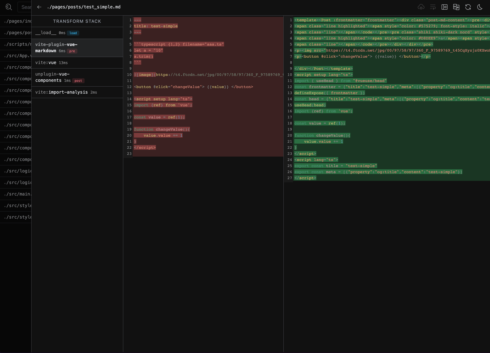
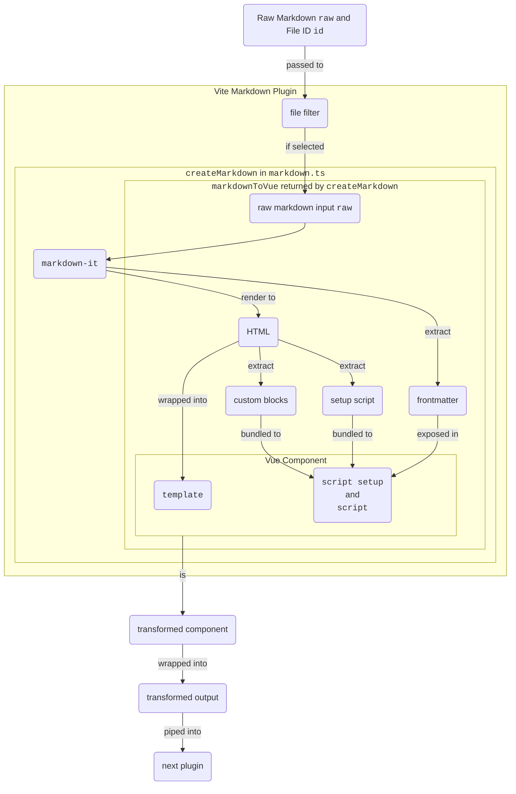

This post is dedicated to cover the design and implementation details
of [`vite-plugin-vue-markdown`](https://github.com/mdit-vue/vite-plugin-vue-markdown).
Note that the plugin is archived and is rewritten
in [`unplugin`](https://github.com/unjs/unplugin)
as [`unplugin-vue-markdown`](https://github.com/unplugin/unplugin-vue-markdown)

@en@ When a Vite project is created, a `vite.config.ts` file will be
created to manage the configuration of the Vite project. Under
the `vite.config.ts` file, we lines that resemble the following code

```ts filename="vite.config.ts" {3,11-13}
import vue from '@vitejs/plugin-vue'
import pages from 'vite-plugin-pages'
import markdown from 'vite-plugin-vue-markdown'
import inspect from 'vite-plugin-inspect'
// other imports

export default defineConfig({
  plugins: [
    vue(),
    pages(),
    markdown({
      // options here
    }),
    inspect(),
  ],
})
```

Because I started a Vue project with Vite, the official `vue` plugin is used in
the `plugins` field. We can of course add more plugins into it. All the plugins
will work with Vite to form a pipeline that transforms code when appropriate.

Right now, I have added `vite-plugin-pages` which automatically convert files to
components and create route configurations for `vue-router`, `markdown` which
converts Markdown files into Vue components, and `inspect` which allows us to
see and debug the effects of each plugins in different stages.

In the following paragraphs, we will cover
how [`vite-plugin-vue-markdown`](https://github.com/mdit-vue/vite-plugin-vue-markdown.git)
works. Before that, let's take a peek at the inspect
page (`localhost:5173/__inspect` on my machine) provided by
the `vite-plugin-inspect`.

````markdown fileName="test_simple.md" {14-23}
---
title: test-simple
---

```typescript {1,2} filename="aaa.ts"
let a = '10'
a.trim()
```


<button @click="changeValue"> {{value}} </button>

<script setup lang="ts">
import {ref} from 'vue';

const value = ref(1);

function changeValue(){
    value.value += 1
}
</script>
````



The inspect page shows us three panels. The left most one show that the pipeline
stages this file has passed through. For example, this `test_simple.md` file has
passed through 5 stages and the `vite-plugin-vue-markdown` takes place in the
second stage.
The transform details shown on the diff panels in red and green seems to
indicate that the Markdown content is rendered to HTML and then wrapped
with `<template>` and appended with `<script setup>` tags. In
the `<script setup>` tags, we can see the frontmatter is exposed along with the
piece of custom setup script in the original Markdown content. The plugin
essentially changes the Markdown content into a Vue component. We can see that
the transformed Vue component is then passed into the `vue` plugin. After
post-processing, it's then delivered to the browser and rendered.


It looks clear that the goal of this plugin is transform markdown content into a
vue component. This is brilliant because this preserves the reactivity that may
be specified in the Markdown. For example, in the example page above, the button
is actually interactive. You can see that the highlighted code very similar to
what could be written in a Vue component.

In the following code snippets, Because the code will be long so I won't specify
everything at once, you might find GitHub icon on the top right helpful. The
icon will take you to the GitHub repo of that file. The file names will also be
specified in the top left corner to help you locate the context.

We will start
from [`src/index.ts`](https://github.com/mdit-vue/vite-plugin-vue-markdown/blob/6db0486189ce9953078e73b48d19b426365e7ec9/src/index.ts).
When we the plugin factory from `vite-plugin-vue-markdown` by
using `import markdown from 'vite-plugin-vue-markdown'`, we are importing
the `VitePluginMarkdown` function from `/src/index.ts`.

The factory has the following structure: 1. resolve configuration options; 2.
create markdown renderer and transformer using the resolved options; 3. create
file filter; 4. return the actual plugin object

```ts {2-3,5-6,8-12,14-16} filename="/src/index.ts"
function VitePluginMarkdown(userOptions: Options = {}): Plugin {
  // resolve options (1)
  const options = resolveOptions(userOptions)

  // create Markdown renderer (2)
  const markdownToVue = createMarkdown(options)

  // create filter (3)
  const filter = createFilter(
    userOptions.include || /\.md$/,
    userOptions.exclude,
  )

  return {
    // the plugin detail (4)
  }
}

export default VitePluginMarkdown
```

The plugin specifies and implements `name`, `enforce`, `transform`,
and `handleHotUpdate`. The `name` just serves as an identifier for Vite. What
actually participate in the transformation is the rest three fields: `enforce`
is used to specify the order of this plugin on the Vite pipeline; `transform`
transforms the raw markdown content to a Vue component; `handleHotUpdate`
handles hot update when the dev server detects changes.

```ts filename="index.ts" {15-22}
function VitePluginMarkdown(userOptions: Options = {}): Plugin {
  // resolve options (1)
  const options = resolveOptions(userOptions)

  // create Markdown renderer (2)
  const markdownToVue = createMarkdown(options)

  // create filter (3)
  const filter = createFilter(
    userOptions.include || /\.md$/,
    userOptions.exclude,
  )

  return {
    name: 'vite-plugin-vue-markdown',
    enforce: 'pre',
    transform(raw, id) {
      // transform details
    },
    async handleHotUpdate(ctx) {
      // hot update server impl details
    },
  }
}

export default VitePluginMarkdown
```

1. `enforce`: [The official documents says](https://vitejs.dev/guide/api-plugin.html#conditional-application)
   that `enforce` can take two possible values: `pre` and `post`. A plugin can
   specify this field to let Vite order it before or after the defaulted
   position which comes after Vite's core plugins like the official `vue`
   plugin. That is, plugins specify `pre` will be executed before core plugins,
   and those specify `post` will be executed after core plugins. A detailed
   ordering is provided below. Here, it's crucial to specify `enforce: 'pre'`
   because the markdown content has to be transformed to a Vue component before
   passed into the `vue` plugin.

   - Alias
   - User plugins with enforce: 'pre'
   - Vite core plugins
   - User plugins without enforce value
   - Vite build plugins
   - User plugins with enforce: 'post'
   - Vite post build plugins (minify, manifest, reporting)

2. `transform` is where the transformation takes place. We can see that it's
   actually very simple. First, run the current content's id through the filter
   and if it did pass the filter, `undefined` is returned to indicate no
   transformation is done. By default, we are filtering ids that end with `.md`.
   Then, the raw content is passed to a helper function that converts the raw
   content into Vue component.

   ```ts fileName="index.ts" {3-11}
   return {
     //...
     transform(raw, id) {
       if (!filter(id)) return
       try {
         return markdownToVue(id, raw)
       } catch (e: any) {
         this.error(e)
       }
     },
     //...
   }
   ```

3. `handleHotUpdate` is similar except we read from the changed file first.

The whole transformation can be demonstrated in the following diagram:



We can find the source code for each component
in [`/src/markdown.ts`](https://github.com/mdit-vue/vite-plugin-vue-markdown/blob/6db0486189ce9953078e73b48d19b426365e7ec9/src/markdown.ts).
You can click on nodes on diagram above to jump to the specific source.

Using a similar structure, we create a simple plugin to Vite that wraps all
image markdown syntax with a custom tag. For example, we can wrap the image with
a magnifier vue component such that when you click the image, it brings up an
overlay and enables zooming and panning features.

```ts
import type { Plugin, TransformResult } from 'vite'
import { createFilter } from 'vite'

export interface Options {
  wrappingTag?: string
  include?: string[]
  exclude?: string[]
  matchRe?: RegExp
  converter?: (matched: RegExpMatchArray, tag: string) => string
}

export type ResolvedOptions = Required<Options>

export const DEFAULT_OPTIONS: ResolvedOptions = {
  wrappingTag: 'Magnifier',
  include: ['**/*.md'],
  exclude: [],
  matchRe: /!\[(.*?)\]\((.*?)\)/g,
  converter(matched, tag) {
    return `<${tag}>\n\n${matched[0]}\n\n</${tag}>`
  },
}

function resolveOptions(options: Options = {}): ResolvedOptions {
  return {
    ...DEFAULT_OPTIONS,
    ...options,
  }
}

type Extractor = (code: string) => TransformResult

function getExtractor(options: ResolvedOptions): Extractor {
  return code => {
    const { wrappingTag, matchRe, converter } = options
    const matches = code.matchAll(matchRe)

    for (const match of matches)
      code = code.replace(match[0], converter(match, wrappingTag))

    return {
      code,
      map: null,
    }
  }
}

export default function MarkdownImageWrapper(options: Options = {}): Plugin {
  const resolvedOptions = resolveOptions(options)
  const extractor = getExtractor(resolvedOptions)
  const filter = createFilter(resolvedOptions.include, resolvedOptions.exclude)

  return {
    name: 'markdown-image-wrapper',
    enforce: 'pre',
    transform(code, id) {
      if (!filter(id)) return
      return extractor(code)
    },
    async handleHotUpdate(ctx) {
      if (!filter(ctx.file)) return
      const defaultRead = ctx.read
      ctx.read = async () => {
        return extractor(await defaultRead()).code
      }
    },
  }
}
```

Another easy thing we can do immediately is loading files as strings directly
using imports. For example, the following code just loads the specified files
passing the filter and provides it as strings when using import. For example, I
can use `import Shader from './compute_shader.wgsl?raw'` directly and use it as
a string in WebGPU.

```ts
import type { Plugin } from 'vite'
import { createFilter } from 'vite'
import { dataToEsm } from '@rollup/pluginutils'

export type MinifyFactory = (content: string) => Promise<string> | string

interface Options {
  include: string[]
  minify: boolean | MinifyFactory
}

export type UserOptions = Partial<Options>

function defaultMinify(content: string): string {
  return content
}

function resolveConfig(options: UserOptions): Options {
  return {
    ...options,
    include: ['**/*.wgsl'],
    minify: true,
  }
}

export default function (userOptions: UserOptions = {}): Plugin {
  const options = resolveConfig(userOptions)
  const minify = options.minify === true ? defaultMinify : options.minify
  const filter = createFilter(options.include)

  return {
    name: 'vite-plugin-load-string',
    async transform(source, id) {
      if (!filter(id)) return

      return {
        code: dataToEsm(minify ? await minify(source) : source),
        map: null,
      }
    },
  }
}
```
