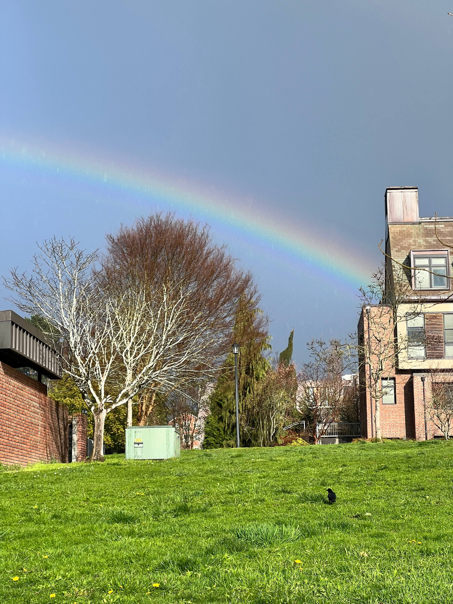
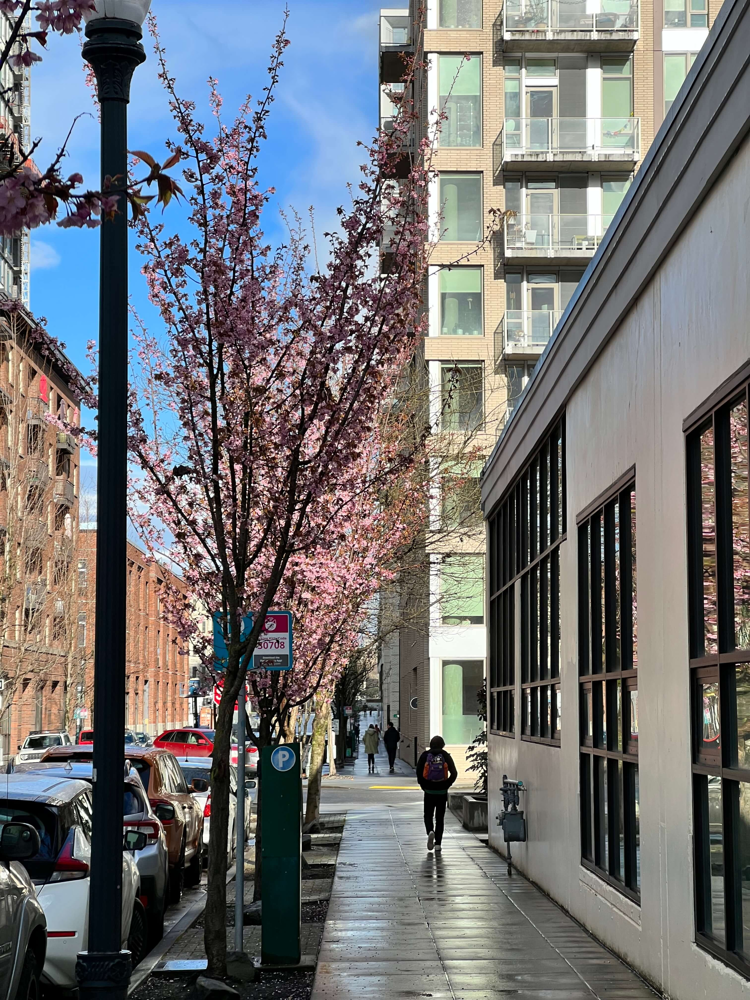
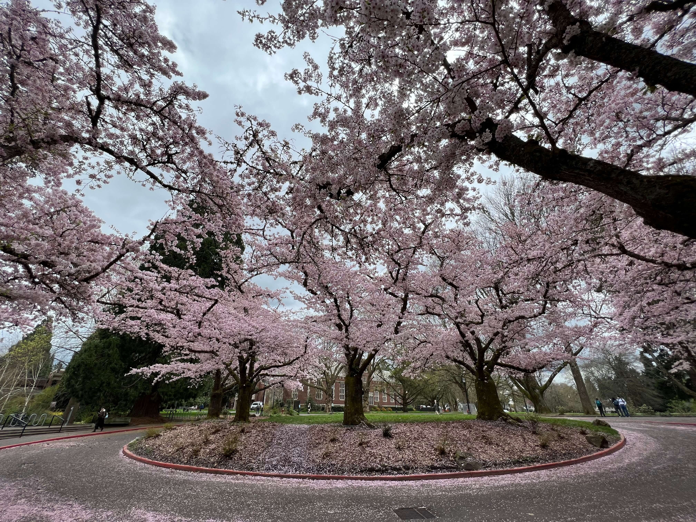
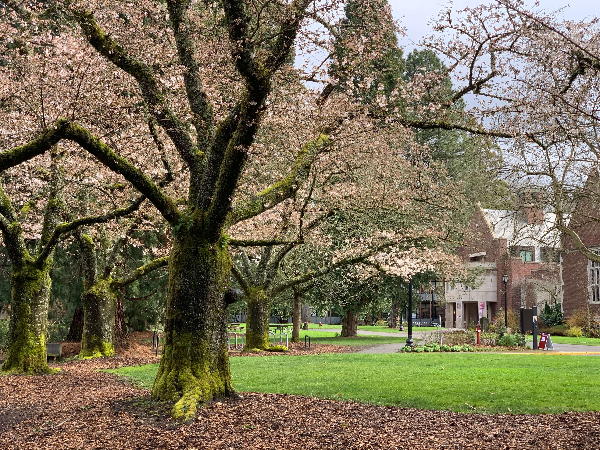
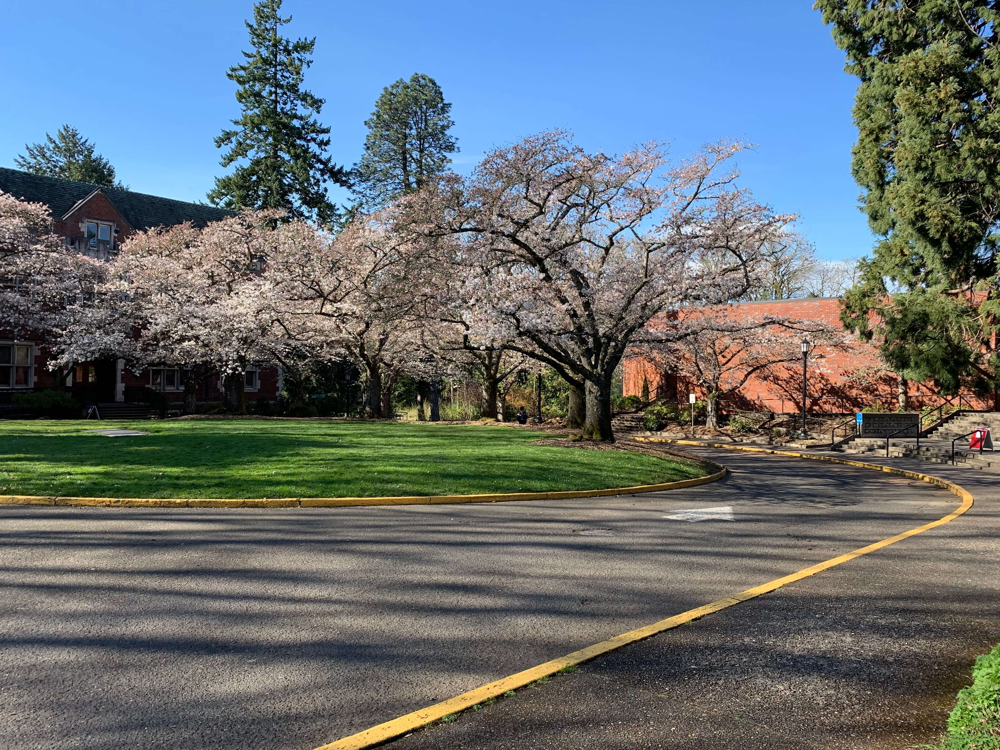
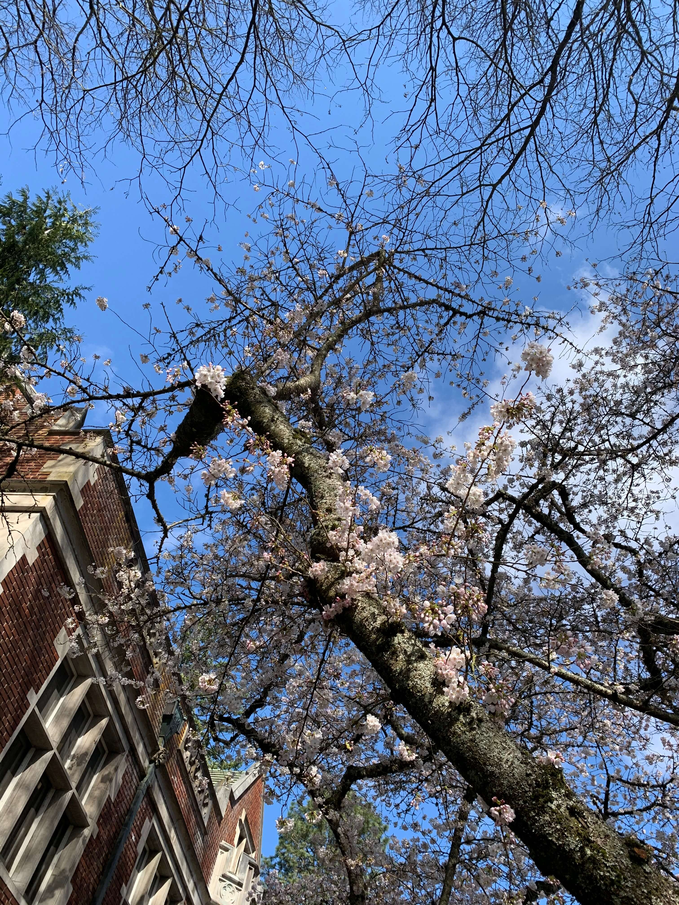

I know I'm a sentimental person and I am not used to admit it.

I've been writing this post for a long time. Some part of me seems broken after
leaving the US and I failed to know how to deal with it. Dates after graduation
has been surreal for me. I remember the first day I arrived at the US for the
first time, staying in a hotel near the airport and staring at the orange sunset
on the shore of a small lake behind the hotel. The most frequent words I say to
people for a while was "surreal" at the time. At yet, I don't know which one is
more surreal, graduating and leaving the US, or the first couple of months of
life in the US. Together, they both feel like fragments of some dream, which can
only be found in memories.

I've been trying to write something since then. But every time a few sentences
were jotted down, they were deleted. I can feel sorting out this departure is
like untangling strings that straps a scary and bleeding wound. Even a tiny
touch feels painful and this pain is something I have yet experienced.

I've been wondering what's hurting me that much. The answer seems simple: the
place, the culture, and the people there. Even though part of my undergrad
journey was not very pleasant, I'm grateful about everything. The professors
were kind and trying to be helpful as much as they can. The peers at Reed were
amazing. We were all trying to break out our comfort zone to learn and grow.
People in Portland were warm-hearted and the environment of Portland cannot be
more perfect in my opinion. I miss talking to peers in the common about the math
problems they are working on; I miss smiling and saying hi to people and they
respond back with a warm greeting and smile; I miss I can just go to the canyon
to see the ducks and swans gliding and swimming in the lake.

But when I look deep into my thoughts, I know it's saying goodbye to all the
friends that hurt me the most, which I acknowledge but am reluctant to show. I
remember the time I was having lunch with John one day near graduation. Spring
was almost, shedding warm sun shines and trying to resolve the winds from
winter; cherry blossoms start to bloom and fly and dancing all over the campus.
We were discussing our plans after graduation and all of a sudden I
realized everything will be gone by the time and I probably can't see my
friends again. The water of emotion breaks down the dam, washing down everything
downstream in my head. It was silent, but yet the water smashed at everything it
touched, splashing up sprays that eventually turned to my tears and streamed
down my face. I cried, hard. John hugged me. It was warm, like the spring sun
shine, shedding on the shattered dam just like an apocalyptic scene in movies.

What I didn't realize is that the water's momentum would not decrease even a
tiny bit in the upcoming months.

I should have hugged all my friends before leaving. For those who I failed to
meet before my departure, I'm truly sorry and I really hope we will meet and
laugh again. I love you, and wish all the best to you.

Today is April 1st 2024, almost a year after the graduation. I can feel the
water is slowing down slightly and the wound is somewhat less painful. I don't
think this means the Reed dream is fading away nor the feelings are fading away.
I don't the memories will always be cherished and will shine like the spring sun
shine, warm and powerful, helping me defend the winds from the winter.

