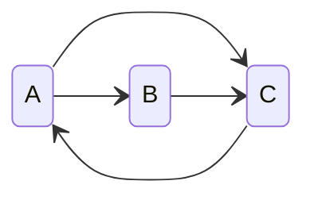

I have been following
the [CS6120](https://www.cs.cornell.edu/courses/cs6120/2023fa/), a self-guided
online course for topics in compilers. It was a great journey following along
the course and the exercises. This post will be the first of my learning note
series of this course.
<!-- more -->

[[TOC]]

## Credit

This post uses [Bril](https://capra.cs.cornell.edu/bril/intro.html),
an compiler IR for learning. Part of the code used for this post was modified
from Bril.

## Introduction

It takes many stages to compile a piece of code: first the code needs to be
parsed from pure strings into defined
[lexical tokens](https://www.wikiwand.com/en/Lexical_token); then tokens are
transformed into structured data like
[abstract syntax trees (ASTs)](https://www.wikiwand.com/en/Abstract_syntax_tree);
[semantics](https://www.wikiwand.com/en/Semantics_(computer_science)) are given
based on the ASTs, often in the form of
[intermediate representations (IRs)](https://www.wikiwand.com/en/Intermediate_representation);
in the end, we eventually get
[machine code](https://www.wikiwand.com/en/Machine_code) that can be run
efficiently.

Here we focus on the semantics side of the programs and how we can optimize the
programs without changing the semantics of the programs. To do this, we need an
abstraction of the program that's more than structured data and allows us to
analyze the flow of the program, or how the program works. This is where
[control flow graphs (CFGs)](https://www.wikiwand.com/en/Control-flow_graph)
come in.

A CFG is a direct graph representing the flow of an algorithm, illustrated in
the graph below. We call the nodes basic blocks. They seem trivial and
don't convey much information, but you can toggle what the blocks actually
represent using the [detail toggle](#simple-prog-detail-toggle).

<SimpleProgram />

Each basic block, identified by a unique label, is a sequence of instructions.
The arrows from pointing from block A to block B indicates that the program may
start executing block B after executing block A.

It is possible and actually quite often for a CFG to have a loop, roughly
corresponding to the loops in the actual program.

To be continued
