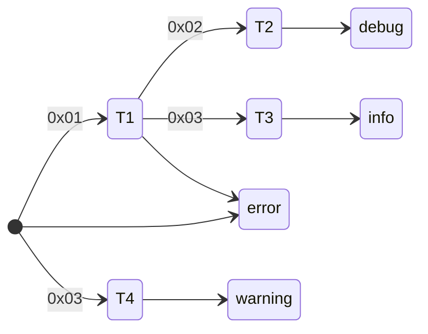

This is part 2 of creating a binary parser macro using Swift Macro, which adds
enum parsing and a printer of parsed objects. You can find
part 1 [here](/posts/2025/binary-parser-and-macros).

<!-- more -->

[[TOC]]

## Showcase

> [!IMPORTANT]
> At the time of writing, this package's dependency `swift-binary-parsing` is
> under development and its API may have changed since.

> [!IMPORTANT]
> `BinaryParseKit` is currently under active development and its API may face
> drastic changes.

The source code repository
is [here](https://github.com/FlickerSoul/BinaryParseKit).

Suppose I have a packet whose structure depends on the first byte. The first
byte indicates if the packet represents a successful response or an error
message. In the success case, the response has 3 kinds: either a sos open
message, sos close message, or a location update message.

```swift
enum SosSuccessResponse {
    // 0x01
    case open(messageHeader: Header, latitude: Float, longitude: Float)
    // 0x02
    case close(messageHeader: Header)
    // 0x03
    case locationUpdate(messageHeader: Header, latitude: Float, longitude: Float)
}

enum SosResponse {
    // 0x00
    case success(response: SosSuccessResponse)
    // 0x01
    case error(code: UInt8)
}

struct Header {
    @parse(endianness: .big)
    let timestamp: UInt32
    @parse(endianness: .big)
    let id: UInt16
}
```

We can generate parsing automatically by using `BinaryParseKit` macros and
importing `BinaryParing` from `swift-binary-parsing` library:

```swift
import BinaryParseKit 
import BinaryParsing

@ParseStruct
struct Header {
    @parse(endianness: .big)
    let timestamp: UInt32
   
    @parse(endianness: .big)
    let id: UInt16
}

@ParseEnum
enum SosSuccessResponse {
    @matchAndTake(byte: 0x01)
    @parse
    @parse(endianness: .big)
    @parse(endianness: .big)
    case open(messageHeader: Header, latitude: Float, longitude: Float)

    @matchAndTake(byte: 0x02)
    @parse
    case close(messageHeader: Header)
    
    @matchAndTake(byte: 0x03)
    @parse
    @parse(endianness: .big)
    @parse(endianness: .big)
    case locationUpdate(messageHeader: Header, latitude: Float, longitude: Float)
}

@ParseEnum
enum SosResponse {
    @matchAndTake(byte: 0x00)
    @parse
    case success(response: SosSuccessResponse)

    @matchAndTake(byte: 0xFF)
    @parse(endianness: .big)
    case error(code: UInt8)
}
```

We can parse the packet in one line.

```swift
let errorData: [UInt8] = [
    0xFF, // SosResponse.error
    0x05, // error code
]
let errorResponse = try SosResponse(parsing: errorData)
print(errorResponse)

let successData: [UInt8] = [
    0x00, // success
    0x03, // location update
    0x64, 0x61, 0x76, 0x00, // header - timestamp
    0x00, 0x12, // header - id
    0x41, 0x20, 0x00, 0x00, // latitude (10.0)
    0xC1, 0x20, 0x00, 0x00  // longitude (-10.0)
]
let successResponse = try SosResponse(parsing: successData)
print(successResponse)
```

The output from the two prints are

```
error(code: 5)
success(response: SosSuccessResponse.locationUpdate(messageHeader: Header(timestamp: 1684108800, id: 18), latitude: 10.0, longitude: -10.0))
```

And using the printer functionality, we can print the parsed objects back to
byte arrays:

```swift
try print(errorResponse.printParsed(printer: .hexString(separator: ", ", prefix: "0x")))
try print(successResponse.printParsed(printer: .hexString(separator: ", ", prefix: "0x")))
```

which outputs

```swift
0xFF, 0x05
0x00, 0x03, 0x64, 0x61, 0x76, 0x00, 0x00, 0x12, 0x41, 0x20, 0x00, 0x00, 0xC1, 0x20, 0x00, 0x00
```

The macro generates the following

<details>
<summary>
Extensions
</summary>

`SosResponse`:

```swift
extension SosResponse: BinaryParseKit.Parsable {
    init(parsing span: inout BinaryParsing.ParserSpan) throws(BinaryParsing.ThrownParsingError) {
        if BinaryParseKit.__match([0x00], in: &span) {
            try span.seek(toRelativeOffset: [0x00].count)
            // Parse `response` of type SosSuccessResponse
            BinaryParseKit.__assertParsable((SosSuccessResponse).self)
            let response = try SosSuccessResponse(parsing: &span)
            // construct `success` with above associated values
            self = .success(response: response)
            return
        }
        if BinaryParseKit.__match([0xFF], in: &span) {
            try span.seek(toRelativeOffset: [0xFF].count)
            // Parse `code` of type UInt8 with endianness
            BinaryParseKit.__assertEndianParsable((UInt8).self)
            let code = try UInt8(parsing: &span, endianness: .big)
            // construct `error` with above associated values
            self = .error(code: code)
            return
        }
        throw BinaryParseKit.BinaryParserKitError.failedToParse("Failed to find a match for SosResponse, at \(span.startPosition)")
    }
}

extension SosResponse: BinaryParseKit.Printable {
    func printerIntel() throws -> PrinterIntel {
        switch self {
        case let .success($s20BinaryParseKitClient11SosResponse0B4EnumfMe_16success_responsefMu_):
            return .enum(
                .init(
                    bytes: [0x00],
                    parseType: .matchAndTake,
                    fields: [.init(byteCount: nil, endianness: nil, intel: try BinaryParseKit.__getPrinterIntel($s20BinaryParseKitClient11SosResponse0B4EnumfMe_16success_responsefMu_))],
                )
            )
        case let .error($s20BinaryParseKitClient11SosResponse0B4EnumfMe_10error_codefMu_):
            return .enum(
                .init(
                    bytes: [0xFF],
                    parseType: .matchAndTake,
                    fields: [.init(byteCount: nil, endianness: .big, intel: try BinaryParseKit.__getPrinterIntel($s20BinaryParseKitClient11SosResponse0B4EnumfMe_10error_codefMu_))],
                )
            )
        }
    }
}
```

`SosSuccessResponse`:

```swift
extension SosSuccessResponse: BinaryParseKit.Parsable {
    init(parsing span: inout BinaryParsing.ParserSpan) throws(BinaryParsing.ThrownParsingError) {
        if BinaryParseKit.__match([0x01], in: &span) {
            try span.seek(toRelativeOffset: [0x01].count)
            // Parse `messageHeader` of type Header
            BinaryParseKit.__assertParsable((Header).self)
            let messageHeader = try Header(parsing: &span)
            // Parse `latitude` of type Float with endianness
            BinaryParseKit.__assertEndianParsable((Float).self)
            let latitude = try Float(parsing: &span, endianness: .big)
            // Parse `longitude` of type Float with endianness
            BinaryParseKit.__assertEndianParsable((Float).self)
            let longitude = try Float(parsing: &span, endianness: .big)
            // construct `open` with above associated values
            self = .open(messageHeader: messageHeader, latitude: latitude, longitude: longitude)
            return
        }
        if BinaryParseKit.__match([0x02], in: &span) {
            try span.seek(toRelativeOffset: [0x02].count)
            // Parse `messageHeader` of type Header
            BinaryParseKit.__assertParsable((Header).self)
            let messageHeader = try Header(parsing: &span)
            // construct `close` with above associated values
            self = .close(messageHeader: messageHeader)
            return
        }
        if BinaryParseKit.__match([0x03], in: &span) {
            try span.seek(toRelativeOffset: [0x03].count)
            // Parse `messageHeader` of type Header
            BinaryParseKit.__assertParsable((Header).self)
            let messageHeader = try Header(parsing: &span)
            // Parse `latitude` of type Float with endianness
            BinaryParseKit.__assertEndianParsable((Float).self)
            let latitude = try Float(parsing: &span, endianness: .big)
            // Parse `longitude` of type Float with endianness
            BinaryParseKit.__assertEndianParsable((Float).self)
            let longitude = try Float(parsing: &span, endianness: .big)
            // construct `locationUpdate` with above associated values
            self = .locationUpdate(messageHeader: messageHeader, latitude: latitude, longitude: longitude)
            return
        }
        throw BinaryParseKit.BinaryParserKitError.failedToParse("Failed to find a match for SosSuccessResponse, at \(span.startPosition)")
    }
}

extension SosSuccessResponse: BinaryParseKit.Printable {
    func printerIntel() throws -> PrinterIntel {
        switch self {
        case let .open($s20BinaryParseKitClient18SosSuccessResponse0B4EnumfMe_18open_messageHeaderfMu_, $s20BinaryParseKitClient18SosSuccessResponse0B4EnumfMe_13open_latitudefMu_, $s20BinaryParseKitClient18SosSuccessResponse0B4EnumfMe_14open_longitudefMu_):
            return .enum(
                .init(
                    bytes: [0x01],
                    parseType: .matchAndTake,
                    fields: [.init(byteCount: nil, endianness: nil, intel: try BinaryParseKit.__getPrinterIntel($s20BinaryParseKitClient18SosSuccessResponse0B4EnumfMe_18open_messageHeaderfMu_)), .init(byteCount: nil, endianness: .big, intel: try BinaryParseKit.__getPrinterIntel($s20BinaryParseKitClient18SosSuccessResponse0B4EnumfMe_13open_latitudefMu_)), .init(byteCount: nil, endianness: .big, intel: try BinaryParseKit.__getPrinterIntel($s20BinaryParseKitClient18SosSuccessResponse0B4EnumfMe_14open_longitudefMu_))],
                )
            )
        case let .close($s20BinaryParseKitClient18SosSuccessResponse0B4EnumfMe_19close_messageHeaderfMu_):
            return .enum(
                .init(
                    bytes: [0x02],
                    parseType: .matchAndTake,
                    fields: [.init(byteCount: nil, endianness: nil, intel: try BinaryParseKit.__getPrinterIntel($s20BinaryParseKitClient18SosSuccessResponse0B4EnumfMe_19close_messageHeaderfMu_))],
                )
            )
        case let .locationUpdate($s20BinaryParseKitClient18SosSuccessResponse0B4EnumfMe_28locationUpdate_messageHeaderfMu_, $s20BinaryParseKitClient18SosSuccessResponse0B4EnumfMe_23locationUpdate_latitudefMu_, $s20BinaryParseKitClient18SosSuccessResponse0B4EnumfMe_24locationUpdate_longitudefMu_):
            return .enum(
                .init(
                    bytes: [0x03],
                    parseType: .matchAndTake,
                    fields: [.init(byteCount: nil, endianness: nil, intel: try BinaryParseKit.__getPrinterIntel($s20BinaryParseKitClient18SosSuccessResponse0B4EnumfMe_28locationUpdate_messageHeaderfMu_)), .init(byteCount: nil, endianness: .big, intel: try BinaryParseKit.__getPrinterIntel($s20BinaryParseKitClient18SosSuccessResponse0B4EnumfMe_23locationUpdate_latitudefMu_)), .init(byteCount: nil, endianness: .big, intel: try BinaryParseKit.__getPrinterIntel($s20BinaryParseKitClient18SosSuccessResponse0B4EnumfMe_24locationUpdate_longitudefMu_))],
                )
            )
        }
    }
}
```

`Header`:

```swift
extension Header: BinaryParseKit.Parsable {
    init(parsing span: inout BinaryParsing.ParserSpan) throws(BinaryParsing.ThrownParsingError) {
        // Parse `timestamp` of type UInt32 with endianness
        BinaryParseKit.__assertEndianParsable((UInt32).self)
        self.timestamp = try UInt32(parsing: &span, endianness: .big)
        // Parse `id` of type UInt16 with endianness
        BinaryParseKit.__assertEndianParsable((UInt16).self)
        self.id = try UInt16(parsing: &span, endianness: .big)
    }
}

extension Header: BinaryParseKit.Printable {
    func printerIntel() throws -> PrinterIntel {
        return .struct(
            .init(
                fields: [.init(byteCount: nil, endianness: .big, intel: try BinaryParseKit.__getPrinterIntel(timestamp)), .init(byteCount: nil, endianness: .big, intel: try BinaryParseKit.__getPrinterIntel(id))]
            )
        )
    }
}
```

</details>

## Background

When designing enum parsing macro, I have considered the following goals:

- Allow the parser to match enum cases by specific byte patterns, either it's
  one byte or multiple bytes.
- Allow the parser to have a fallback case when no other cases are matched.
- Allow the parser to choose to consume or not consume the matched bytes.
- Allow the parser to match enum who conforms to `Matchable`, eliminating the
  need to specify matching attributes in cases like enums conforming to
  `RawRepresentable`.
- Allow the parser to match associated values of each enum case using explicit
  parsing attributes.

When designing the printer and printing, I have considered the following goals:

- The parsed objects should generate information (`PrinterIntel`) for printers
  to print back.
  This would allow the printers to be generic, thus allowing custom printers to
  be implemented, such as printing to hex strings, JSON, etc.
- `PrinterIntel` should contain sufficient information for printers to print
  the parsed objects back to byte arrays.

## The Design Process

### Enum Matching

Each enum case should be matched by specific byte patterns, either a single
byte (`@match(byte:)`), a array of multiple bytes (`@match(bytes:)`), or
nothing (`@matchDefault`). Byte patterns from macros are extracted into byte
arrays and compared with the input buffer. The brutal force approach in the
current implementation is to try matching each byte array with the buffer one by
one until a match is found. If there is a `@matchDefault` case, it's guaranteed
to be specified at the end by `@ParseEnum` macro, and it will be matched when no
other cases are matched. There is no conflict detection at this moment, since
matching is sequential from the first declaration to the last, and thus the
first matched is chosen.

A future improvement is to build a graph of byte patterns for faster matching.
The idea is similar
to [a previous project I did on building a tokenizer](/posts/2023/kaleidoscope).

Suppose we'd like to match the following enum:

```swift
enum Message {
    @match(bytes: [0x01, 0x02])
    case debug
    
    @match(bytes: [0x01, 0x03])
    case info
    
    @match(byte: 0x03)
    case warning
    
    @matchDefault
    case error
}
```

We could build a matching graph like the following, there `Tn` represents a
state in the matching process, and the arrows represent transitions by matching
bytes. If no match of byte is found in a given state, the matching process can
take the transition without any byte, which leads to the `error` case.



### Printing

Printer intel have 4 kinds: struct, enum, builtIn, and, skip. Struct intel and
enum
intel contain fields or associated values' printing information. BuiltIn intel
serve as terminals of printing, which contains byte arrays to be printed. Skip
intel contains the number of bytes to skipped during parsing and printers would
decide with it what to print in the absence of source information.

When generating printer intel from parsed objects, the macro traverses the
fields of struct or associated values of enum cases and use `__getPrinterIntel`
on each. `__getPrinterIntel` generates printer intel for each field if the
field's type conforms to `Printable` or throws an error:

```swift
public func __getPrinterIntel<T>(_ value: T) throws -> PrinterIntel {
    if let intel = (value as? Printable) {
        return try intel.printerIntel()
    } else {
        throw PrinterError.notPrintable(type: T.self)
    }
}
```

If a custom type wants to be printable, it could conform to `Printable` and
generate a `builtIn` intel with the byte array it wants to print:

```swift
extension MyType: Printable {
    func printerIntel() throws -> PrinterIntel {
        let bytes: [UInt8] = ... // byte array in big endian
        return .builtIn(.init(
            bytes: bytes,
            fixedEndianness: false, // indicates if endianness is fixed
        ))
    }
}
```

I don't like the current design of `builtIn`. It wants the `bytes` field to be
in big endian, and flips the byte order in printers if the target endianness is
little endian and `fixedEndianness` is set to `false`. It also doesn't allow
lazy generation. Suppose a builtIn intel has a large byte array, it would be
better to generate the byte array only when printing is needed. Maybe a better
intel would be like

```swift
struct BuiltInPrinterIntel {
    typealias ByteGenerator = (Endianness?) -> [UInt8]
    let bytes: ByteGenerator
}
```

## Discussion and Future Direction

#### Match By Length

We can use `@match(byteCount:)` to indicate matching enum cases by remaining
buffer size. This is useful when cases can be distinguished by the length of
byte buffers. We can also introduce `@matchElse` to match uncovered length size,
and similarly, exact matching failure in absence of `@matchElse` would throw an
error.

For instance, suppose a response byte buffer has three distinct cases: success,
channel failure, unknown failure, and they have the following structure

- success will yield a list of `(lat: Float, long: Float)` tuples whose size is
  guaranteed to be greater than 0.
- channel failure will yield a `UInt32` channel ID.
- unknown failure will yield a `UInt8` error code.

```swift
@ParseEnum
enum Response {
    typealias Loc = (lat: Float, long: Float)
    typealias Locs = [Loc]
    typealias ChannelID = UInt32
    typealias ErrorCode = UInt8

    @matchElse
    @parse
    case success(Locs)
    
    @match(byteCount: MemoryLayout<ChannelID>.size)
    @parse(endianness: .big)
    case channelFailure(id: ChannelID)
    
    @match(byteCount: MemoryLayout<ErrorCode>.size)
    @parse
    case unknownError(code: ErrorCode)
}
```

### Parsing by bitmasks

[A feedback](https://forums.swift.org/t/binaryparsekit-declarative-binary-parsing-with-swift-macros/83132/4)
from [my Swift Forum post](https://forums.swift.org/t/binaryparsekit-declarative-binary-parsing-with-swift-macros/83132/)
suggests adding support for parsing by bitmasks. The syntax that came on top of
my head is like the following. But it doesn't feel quite right at this moment,
so I'll keep pondering on it.

```swift
@ParseBitMask(byteCount: 1)
struct Flags {
    @parseBits(bitCount: 3)
    let flagA: FlagA
    
    @parseBits(bitCount: 1)
    let flagB: Bool
}
```

### Verbose API

At this moment, it takes a lot of typing to specify parsing, such as
`@ParseStruct`/`@ParseEnum`, and
`@parse(byteCount: 1, endianness: .little)`. Also in parsing enum associated
values of enum cases, developers have to spell out all the parsing attributes
for each associated value.

Currently, the APIs are verbose but precise. If
you have any suggestions of more concise APIs without sacrificing precision, I
would appreciate if you can share.
