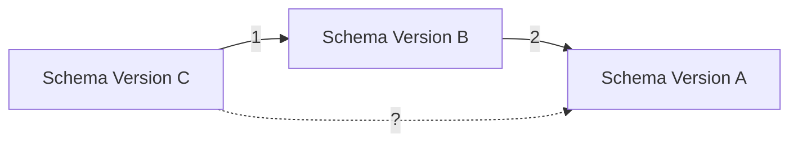
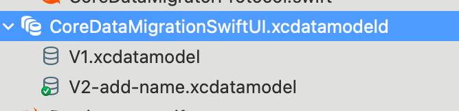

Without progressive migration, an app with a database won't go too far before it
breaks down due to schema incompatibility. Since CoreData lacks this essential
feature, this post describes my journey of implementing it. This is a
modification and consolidation
of [an implementation described in this post](https://williamboles.com/progressive-core-data-migration/),
authored by William Boles, so that it can work with modern Swift and SwiftUI.

<!-- more --> 

[[TOC]]

## Credit

The code is a modification and consolidation
of [an implementation described in this post](https://williamboles.com/progressive-core-data-migration/),
authored by William Boles, so that it can work with modern Swift and SwiftUI.

## Background

Coming from mature ORMs like Prisma and the one in Django, I assumed CoreData,
the native persistence solution provided, has essential features developers
need. On my way of making my third migration for an iOS app, I suddenly realized
that I don't have
a [migration history](https://www.prisma.io/docs/orm/prisma-migrate/understanding-prisma-migrate/migration-histories).
Googling such absence gave me an unestimated
shock: CoreData doesn't have progressive migration. I really hope I read it
wrong here, but from my limited research, there doesn't seem to exist any
infrastructure that handles progressive migration fully. One of the requirements
of the app is to support iOS 16, in which SwiftData doesn't exist. So even
though SwiftData seems to have progressive migration built in (see [
`SchemaMigrationPlan`](https://developer.apple.com/documentation/swiftdata/schemamigrationplan)),
it's out of my scope.

Progressive migration solves the problem of migrating from arbitrary outdated
database schemas to the current one. Suppose we our current database schema is
version `A`, `B` is the immediate predecessor before `A`, and `C` is the
immediate predecessor before `B`, as illustrated in the diagram below. Even
though the migration path from `C` to `B` and that from `B` to `A` are defined,
as illustrated as `1` and `2` in the diagram below,
CoreData would still have a hard time figuring out how to migrate from `C` to
`A`, as there isn't an explicit migration strategy defined.



Thus, I embarked on a journey of search for code that migrates from `C` to `A`
manually. Fortunately, this has been figured out by William Boles in
their [blog post](https://williamboles.com/progressive-core-data-migration/). I
recommend reading the original post, as it's explained in great details.
The [original sample code](https://github.com/wibosco/CoreDataMigrationRevised-Example)
was written quite a long time ago for UIKit.

Here, I'm going to my adaption for SwiftUI in modern Swift. I'm going to explain
how progressive migration can be done manually, which idea is the same in the
William Boles' post, and then explain special treatment for integration with
SwiftUI, SwiftUI preview, and Testing. You can find the source code of this post
in
this [GitHub repository](https://github.com/FlickerSoul/CoreDataProgressiveMigration).

## Prerequisites

You should know how to create a new version of CoreData model, and what a
light-weight/heavy migration is.

## How it's done

### Defining Migrations

We start by defining the versions of database schemas. As illustrated in the
diagram above, databases have clear versioning that builds one above another. To
define how progressive migrations can take place, we first define these
versions, and how these versions are related to each other.

```swift
import CoreData

enum CoreDataMigrationVersion: String, CaseIterable {
    case v1 = "V1"
    case v2 = "V2-add-name"
}
```

We model versions in an enum, where each case has a `String` raw value
representing the naming of the that particular version. These names correspond
to the versions in your CoreData model.



We then define the latest version, by using the convenience of `CaseIterable`,
so that we don't forget changing the latest version when a new version is added.

```swift
enum CoreDataMigrationVersion: String, CaseIterable {
    // omitted...

    // MARK: - Current
    
    static var current: CoreDataMigrationVersion {
        guard let current = allCases.last else {
            fatalError("no model versions found")
        }

        return current
    }
}
```

Then, we can define a state machine, of how one version can be migrated to the
other. Since the latest version doesn't have a successor, it will be `nil`. We
could rely on `CaseIterable` to generate a linear history of versions, but this
manual statement gives us the flexibility to control the migration path. For
instance, suppose that, before a `v2` is released, a new `v3` is created, we can
make the next version of `v1` to be `v3`, and skip the migration of `v2`
entirely.

```swift
enum CoreDataMigrationVersion: String, CaseIterable {
    // omitted...

    // MARK: - Migration

    func nextVersion() -> CoreDataMigrationVersion? {
        switch self {
        case .v1: .v2
        case .v2: nil
        }
    }
}
```

### Figure Out Migrations

We model each migration from one version to the other as an
`CoreDataMigrationStep`. Each step knows the previous version it migrates from,
the next version it's migrating to, and a mapping model of how the migration can
be achieved. The definition of `CoreDataMigrationError` can be
found [here](https://github.com/FlickerSoul/CoreDataProgressiveMigration/blob/main/CoreDataMigrationSwiftUI/Persistence/ProgressiveMigration/CoreDataMigrationError.swift),
and will be used in the rest of this post.

```swift
struct CoreDataMigrationStep {
    let sourceModel: NSManagedObjectModel
    let destinationModel: NSManagedObjectModel
    let mappingModel: NSMappingModel

    // MARK: Init

    init(
        sourceVersion: CoreDataMigrationVersion,
        destinationVersion: CoreDataMigrationVersion
    ) throws(CoreDataMigrationError) {
        let sourceModel = try NSManagedObjectModel.managedObjectModel(forVersion: sourceVersion)
        let destinationModel = try NSManagedObjectModel.managedObjectModel(forVersion: destinationVersion)

        guard let mappingModel = CoreDataMigrationStep.mappingModel(
            fromSourceModel: sourceModel,
            toDestinationModel: destinationModel
        ) else {
            NSLog("Expected model mapping from \(sourceVersion.rawValue) to \(destinationVersion.rawValue) not present")
            throw .missingMigrationMapping(source: sourceVersion, destination: destinationVersion)
        }

        self.sourceModel = sourceModel
        self.destinationModel = destinationModel
        self.mappingModel = mappingModel
    }
}
```

The realization of obtaining the managed object model of a particular version
and figuring out the migration mapping model are done using the following
extensions.

The first extension fetches the version from compiled CoreData `.xcdatamodeld`.

```swift
extension NSManagedObjectModel {
    // MARK: - Get Object Model By Version

    static func managedObjectModel(forVersion version: CoreDataMigrationVersion) throws(CoreDataMigrationError)
        -> NSManagedObjectModel {
        let mainBundle = Bundle.main
        // IMPORTANT: change this (`CoreDataMigrationSwiftUI`) to the name of your `.xcdatamodeld`
        let subdirectory = "CoreDataMigrationSwiftUI.momd"
        let modelName = version.rawValue

        let omoURL = mainBundle.url(forResource: modelName, withExtension: "omo", subdirectory: subdirectory)
        let momURL = mainBundle.url(forResource: modelName, withExtension: "mom", subdirectory: subdirectory)

        guard let url = omoURL ?? momURL else {
            NSLog("unable to find model in bundle of name \(modelName) in \(subdirectory) in \(Bundle.main.bundlePath)")
            throw .failToFindModelDefinition
        }

        guard let model = NSManagedObjectModel(contentsOf: url) else {
            NSLog("unable to load model in bundle of name \(modelName) at URL \(url)")
            throw .failToLoadModelDefinition
        }

        return model
    }
}
```

And the second extension checks if a heavy migration is defined, using a
`.xcmappingmodel`, or a `NSEntityMigrationPolicy`, or if
an [light-weight migration](https://developer.apple.com/library/archive/documentation/Cocoa/Conceptual/CoreDataVersioning/Articles/vmLightweightMigration.html#//apple_ref/doc/uid/TP40004399-CH4-SW1)
can be inferred. And in the case where no heavy migration is defined and an
lightweight migration cannot be inferred, the initialization of a
`CoreDataMigrationStep` will throw and fail.

```swift
extension CoreDataMigrationStep {
    private static func mappingModel(
        fromSourceModel sourceModel: NSManagedObjectModel,
        toDestinationModel destinationModel: NSManagedObjectModel
    ) -> NSMappingModel? {
        guard let customMapping = customMappingModel(
            fromSourceModel: sourceModel,
            toDestinationModel: destinationModel
        ) else {
            return inferredMappingModel(fromSourceModel: sourceModel, toDestinationModel: destinationModel)
        }

        return customMapping
    }

    private static func inferredMappingModel(
        fromSourceModel sourceModel: NSManagedObjectModel,
        toDestinationModel destinationModel: NSManagedObjectModel
    ) -> NSMappingModel? {
        try? NSMappingModel.inferredMappingModel(forSourceModel: sourceModel, destinationModel: destinationModel)
    }

    private static func customMappingModel(
        fromSourceModel sourceModel: NSManagedObjectModel,
        toDestinationModel destinationModel: NSManagedObjectModel
    ) -> NSMappingModel? {
        NSMappingModel(from: [Bundle.main], forSourceModel: sourceModel, destinationModel: destinationModel)
    }
}
```

### The Actual Migrating

To migrate a database, (1) we need to know if it actually needs to be migrated,
and if so, (2) handle the migration. Thus we define the following protocol.

```swift
protocol CoreDataMigratorProtocol: Sendable {
    func requiresMigration(
        at storeURL: URL,
        toVersion version: CoreDataMigrationVersion
    ) throws(CoreDataMigrationError) -> Bool

    func migrateStore(at storeURL: URL, toVersion version: CoreDataMigrationVersion) throws(CoreDataMigrationError)
}
```

We then create the `CoreDataMigrator` that implements this protocol.

For `requiresMigration` method, we read the metadata of a given database store,
find in all defined versions, the version that posses the metadata, and check if
that version found is the version we
are migrating to. If it is, we are on the latest version, and no migration is
needed. If it's not, we are on some older version, and should call the
`migrateStore` method to migrate our current database store.

```swift
final class CoreDataMigrator: CoreDataMigratorProtocol {
    func requiresMigration(
        at storeURL: URL,
        toVersion version: CoreDataMigrationVersion
    ) throws(CoreDataMigrationError) -> Bool {
        guard let metadata = NSPersistentStoreCoordinator.metadata(at: storeURL) else {
            return false
        }

        return try CoreDataMigrationVersion.compatibleVersionForStoreMetadata(metadata) != version
    }
}
```

To migrate the existing database store to a specific version, we do the
following steps

1. Find a series of `CoreDataMigrationStep`s that can migrate the current store
   to the latest one. (see the `while` loop in the `migrationSteps` method)
2. Create a `NSMigrationManager` that creates a new database store that's
   migrated from its predecessor version, in the temporary directory.
3. Once migration is successful, replace the current old database store with the
   new one in the temporary directory
4. Do step 2 and 3 until all migrationi steps are completed.

```swift
final class CoreDataMigrator: CoreDataMigratorProtocol {
    // omitted...

    func migrateStore(at storeURL: URL, toVersion version: CoreDataMigrationVersion) throws(CoreDataMigrationError) {
        try forceWALCheckpointingForStore(at: storeURL)

        var currentURL = storeURL
        let migrationSteps = try migrationStepsForStore(at: storeURL, toVersion: version)

        for migrationStep in migrationSteps {
            let manager = NSMigrationManager(
                sourceModel: migrationStep.sourceModel,
                destinationModel: migrationStep.destinationModel
            )
            let destinationURL = URL(fileURLWithPath: NSTemporaryDirectory(), isDirectory: true)
                .appendingPathComponent(UUID().uuidString)

            do {
                try manager.migrateStore(
                    from: currentURL,
                    sourceType: NSSQLiteStoreType,
                    options: nil,
                    with: migrationStep.mappingModel,
                    toDestinationURL: destinationURL,
                    destinationType: NSSQLiteStoreType,
                    destinationOptions: nil
                )
            } catch {
                NSLog(
                    "failed attempting to migrate from \(migrationStep.sourceModel) to \(migrationStep.destinationModel), error: \(error)"
                )

                throw .failToMigrate(
                    source: migrationStep.sourceModel,
                    destination: migrationStep.destinationModel,
                    error: error
                )
            }

            if currentURL != storeURL {
                // Destroy intermediate step's store
                try NSPersistentStoreCoordinator.destroyStore(at: currentURL)
            }

            currentURL = destinationURL
        }

        try NSPersistentStoreCoordinator.replaceStore(at: storeURL, withStoreAt: currentURL)

        if currentURL != storeURL {
            try NSPersistentStoreCoordinator.destroyStore(at: currentURL)
        }
    }
}
```

### Fit in CoreData Stack

Before we call `loadPersistentStores` on any `NSPersistent[CloudKit]Container`,
we first need to migrate the stores. We thus create a `migrateStoreIfNeeded`
function that will be called before `loadPersistentStores`, and a `setup` method
that will setup the CoreData stack.

```swift
struct PersistenceController {
    // omitted....

    func setup(inMemory: Bool = false) async throws(PersistenceError) {
        do {
            if !inMemory {
                try migrateStoreIfNeeded()
            }

            return try await withCheckedThrowingContinuation { continuation in
                container.loadPersistentStores { storeDescription, error in
                    if let error = error as NSError? {
                        NSLog("Unresolved error during persistent store loading: \(error), \(error.userInfo)")
                        continuation.resume(throwing: PersistenceError.failToLoadPersistentStore(underlying: error))
                    }

                    NSLog("Persistent store loaded successfully: \(storeDescription)")
                    continuation.resume(returning: ())
                }
            }
        } catch let error as PersistenceError {
            NSLog("Failed to set up persistent container: \(error)")
            throw error
        } catch let error as CoreDataMigrationError {
            NSLog("Core Data migration failed: \(error)")
            throw PersistenceError.failToMigrateStore(underlying: error)
        } catch {
            NSLog("Unexpected error during persistent container setup: \(error)")
            fatalError("This shouldn't happen")
        }
    }

    private func migrateStoreIfNeeded() throws(CoreDataMigrationError) {
        guard let storeURL = container.persistentStoreDescriptions.first?.url else {
            NSLog("persistentContainer was not set up properly, missing store URL")
            throw CoreDataMigrationError.containerMisconfigured
        }

        if try migrator.requiresMigration(at: storeURL, toVersion: CoreDataMigrationVersion.current) {
            try migrator.migrateStore(at: storeURL, toVersion: CoreDataMigrationVersion.current)
        }
    }
}
```

### With SwiftUI

You can notice that in the code above, we used a
`withCheckedThrowingContinuation` to convert `loadPersistentStores` into an
async function, thus making `setup` an async function. Thus allows us to call
`setup` in SwiftUI's [
`task`](https://developer.apple.com/documentation/swiftui/view/task(priority:_:))
modifier. This allows use to control the views and show the actual content when
the CoreData stack is fully initialized.

```swift
@main
struct CoreDataMigrationSwiftUIApp: App {
    let persistenceController = PersistenceController.shared

    @State var isPersistentStoreMigrationSuccessful: Bool?

    var body: some Scene {
        WindowGroup {
            rootContent
                .colorScheme(.light)
                .task {
                    do {
                        try await persistenceController.setup()
                        isPersistentStoreMigrationSuccessful = true
                        NSLog("Database initialized successfully")
                    } catch {
                        isPersistentStoreMigrationSuccessful = false
                        NSLog("Failed to initialize database: \(error)")
                    }
                }
        }
    }

    @ViewBuilder
    var rootContent: some View {
        if let isPersistentStoreMigrationSuccessful {
            if isPersistentStoreMigrationSuccessful {
                contentView
            } else {
                errorScreen
            }
        } else {
            splashScreen
        }
    }
    
    // omitted...
}
```

Alternatively, you can use a publisher from `Combine` such as

```swift
nonisolated let isInitialized: CurrentValueSubject<Bool, Never> = .init(false)
```

and other parts of the application and listen and react to this publisher.

### Bonus: SwiftUI Preview Trait

[SwiftUI preview traits](https://developer.apple.com/documentation/DeveloperToolsSupport/PreviewTrait)
make reusing boilerplate for preview easier. As you noticed, `setup` needs to be
called everytime we use the CoreData model. This facilitates us to create a
preview trait that mimics the structure above and can be reused in all previews.

```swift
struct CoreDataPreviewContentConfig {
    let count: Int
}

private struct CoreDataPreviewTraitModifier: PreviewModifier {
    typealias Context = PersistenceController

    let previewContentConfig: CoreDataPreviewContentConfig

    @State private var isCoreDataInitializedSuccessfully: Bool?

    static func makeSharedContext() async throws -> Context {
        PersistenceController.preview
    }

    func body(content: Content, context: Context) -> some View {
        rootContent(content: content, coreDataController: context)
            .task {
                do {
                    try await context.setup(inMemory: true)
                    setupPreviewContent(in: context)
                    isCoreDataInitializedSuccessfully = true
                    print("Core Data initialized successfully")
                } catch {
                    isCoreDataInitializedSuccessfully = false
                    print("Failed to initialize Core Data: \(error)")
                }
            }
    }

    func setupPreviewContent(in coreDataController: Context) {
        let viewContext = coreDataController.container.viewContext
        for index in 0 ..< previewContentConfig.count {
            let newItem = Item(context: viewContext)
            newItem.timestamp = Date()
            newItem.name = "Preview Item \(index)"
        }
        do {
            try viewContext.save()
        } catch {
            // Replace this implementation with code to handle the error appropriately.
            // fatalError() causes the application to generate a crash log and terminate. You should not use this
            // function in a shipping application, although it may be useful during development.
            let nsError = error as NSError
            print("Cannot save preview content")
            fatalError("Unresolved error in save model context: \(nsError), \(nsError.userInfo)")
        }
    }

    @ViewBuilder
    func rootContent(content: Content, coreDataController: Context) -> some View {
        if let isCoreDataInitializedSuccessfully {
            if isCoreDataInitializedSuccessfully {
                content
                    .environment(\.managedObjectContext, coreDataController.container.viewContext)
            } else {
                Text("Failed to initialize Core Data")
            }
        } else {
            Text("Initializing Core Data...")
        }
    }
}

extension PreviewTrait where T == Preview.ViewTraits {
    static func previewCoreDataContext(contentConfig: CoreDataPreviewContentConfig = .init(count: 10)) -> Self {
        .modifier(CoreDataPreviewTraitModifier(previewContentConfig: contentConfig))
    }
}
```

### Testing

I modified the testing written in `XCTest` in the original post to the new
[`swift-testing` library](https://developer.apple.com/xcode/swift-testing/). The
test performs

1. move the testing database asset (a `.sqlite` database) from the main Bundle
   to a temporary directory
2. call migrate store on the that database, and expect the migration to succeed
3. check the data integrity of the migration

```swift

@Suite("Test Progressive Migration")
struct TestProgressiveMigration {
    let migrator: CoreDataMigrator = .init()
    let tempFileTearDown = TempFileManager()

    @Test("Migrate", arguments: [
        (
            "Migrate from V1 to V2",
            "V1.sqlite",
            CoreDataMigrationVersion.v2,
            Self.migrate_V1_to_V2
        ),
    ])
    func migrate(
        name _: String,
        sourceFileName: String,
        targetVersion: CoreDataMigrationVersion,
        dataTest: (NSManagedObjectContext) async throws -> Void
    ) async throws {
        let sourceURL = try TempFileManager.moveFileFromBundleToTempDirectory(
            filename: sourceFileName,
            subdir: "ProgressiveMigration"
        )

        #expect(throws: Never.self) {
            try migrator.migrateStore(at: sourceURL, toVersion: targetVersion)
        }

        #expect(FileManager.default.fileExists(atPath: sourceURL.path))

        let model = try NSManagedObjectModel.managedObjectModel(forVersion: targetVersion)
        let context = NSManagedObjectContext(model: model, storeURL: sourceURL)

        await #expect(throws: Never.self) {
            try await dataTest(context)
        }

        context.destroyStore()
    }

    static func migrate_V1_to_V2(_ context: NSManagedObjectContext) async throws {
        let itemFetchRequest = NSFetchRequest<Item>(entityName: "Item")
        let items = try context.fetch(itemFetchRequest)
        NSLog("Fetched \(items.count) messages")

        for item in items {
            #expect(item.name == "Unknown")
        }
    }
}
```

## End

I still can't believe that CoreData does not have progressive migration. Maybe
in the WWDC 2025 that's around the corner, we could see some update on this?

Also, I failed to figure out how to add transition or animation to the
transition from splash screen to the actual content in `rootContent` in the main
app definition. If you find out how this can be done, please let me know. :)
