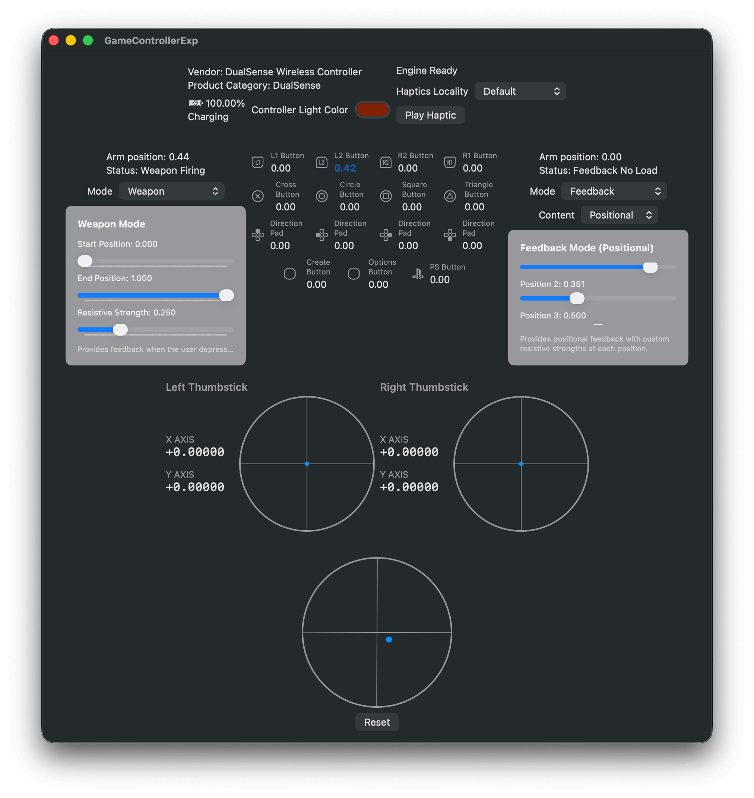
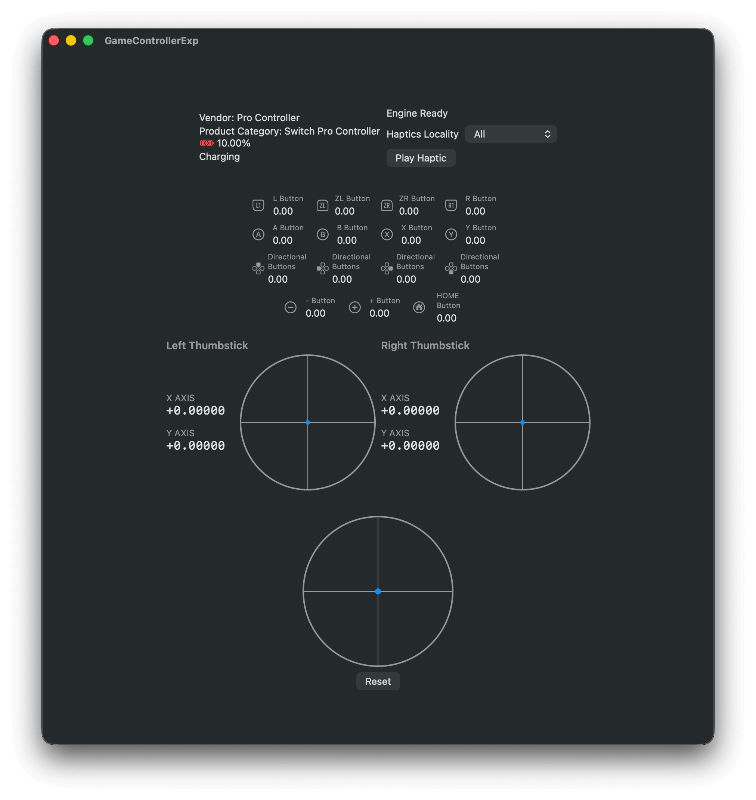
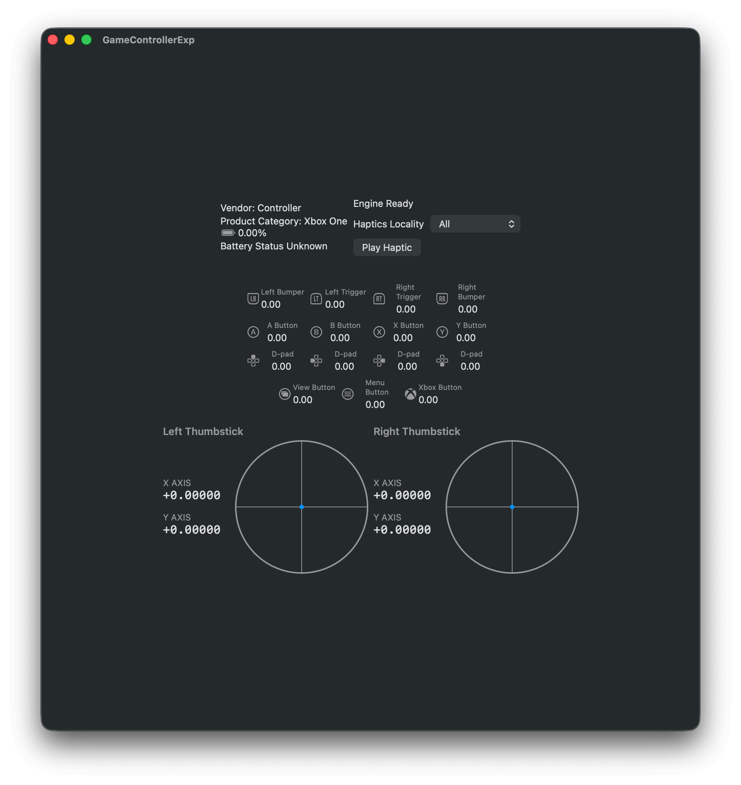

I had fun using Sony's DualSense Edge controller and wanted to make a game
surrounding it, specifically the adaptive trigger. However, it looks like most
of the popular game engines, like Godot, Unity, and UE, don't have
native support for the controller, which means I don't have a quick way to
experiment with the adaptive trigger. So I built this utility in Swift to help
me prototype ideas faster. It can also be used to test button inputs and motions
like a regular game controller tester.

<!-- more --> 

The utility is written in SwiftUI
and [GameController](https://developer.apple.com/documentation/gamecontroller)
library. It provides a simple interface to discover connected game controllers
via [
`GCController.controllers()`](https://developer.apple.com/documentation/gamecontroller/gccontroller/controllers())
as well
as [notifications](https://developer.apple.com/documentation/gamecontroller/gccontroller/controllers()#Discussion)
when controllers are connected or disconnected.

Once a controller is obtained, we can set callbacks to [
`GCControllerLiveInput`](https://developer.apple.com/documentation/gamecontroller/gccontroller/controllers()#Discussion)
when buttons/triggers are fired. The callback provides input state information
via two methods: [`nextInputState` and
`capture`](https://developer.apple.com/documentation/gamecontroller/gccontrollerliveinput),
which provides several collections of physical inputs' states because the return
values conforms to [
`GCDevicePhysicalInputState`](https://developer.apple.com/documentation/gamecontroller/gcdevicephysicalinputstate).

However, the gyroscope and accelerometer data are not included in these
collections. To access these data, we need to use
[`GCMotion`](https://developer.apple.com/documentation/gamecontroller/gcmotion)
in the [
`motion`](https://developer.apple.com/documentation/gamecontroller/gccontroller/motion)
property of `GCController`. The `GCMotion` class also provides
a [callback](https://developer.apple.com/documentation/gamecontroller/gcmotion/valuechangedhandler)
when new gyroscope and accelerometer sensor data is available.

For DualSense's adaptive trigger feature, we need to access the [
`extendedGamepad`](https://developer.apple.com/documentation/gamecontroller/gccontroller/extendedgamepad)
property in a `GCController` instance. If the `extendedGamepad` is
a [
`GCDualSenseGamepad`](https://developer.apple.com/documentation/gamecontroller/gcdualsensegamepad),
we can access the adaptive trigger via `leftTrigger` and `rightTrigger`
properties. They are instances of [
`GCDualSenseAdaptiveTrigger`](https://developer.apple.com/documentation/gamecontroller/gcdualsenseadaptivetrigger)
that provides operations to control the trigger's adaptive behavior.

There are extra information and functionalities we can obtain from a controller:
`battery`, `light`, and `haptics`.

- The `battery` property provides the current battery level and state of the
  controller, such as charging, fully charged, etc.
- The `light` property allows us to control the color and brightness of the
  controller's light bar, if available. From my testing, the light bar's color
  does map very well from RGB values obtained via the system color picker (e.g.
  green in the color picker will be yellow when set and displayed). I'm still
  investigating why.
- The `haptics` property provides access to the controller's haptic feedback
  capabilities, allowing us to create custom vibration patterns. Haptics doesn't
  work from XBox controller for some reason, even though it's possible to obtain
  a haptic engine from the controller.
