I have a problem where I need to automate publishing a (private) Swift package
of a `.xcframework` built from a private library/SDK.

<!-- more --> 

[[TOC]]

## Background

A quick rant before I begin: I've been working as an iOS dev for some
time and this sentence
from [a hacker news post](https://news.ycombinator.com/item?id=39845625)
captures my feeling perfectly: "My time as an
Apple developer left me with the overwhelming sensation that Apple hates its
developers. So much cool looking stuff that mostly worked..."  
This shall be the first of many posts
where I share my experience of working on the unknown pits in swift, which I
hope will help other people along the way to be less frustrated.

Alright, back to the subject. I'm helping my company develop an closed-source
SDK/library in Swift
that will be shared only to a selected number of clients. This SDK will only be
used on iOS and its source code is also internally in my company's iOS app. I
need to figure out a way to automate
building close source swift
package into binaries (`.xcframework` in this case), and distribute them as a
private repository. Since our company uses GitHub, I will need to use GitHub
actions.

Suppose you're creating a library in Swift for
other people to use. It's easy with Swift package: publish your package in
a source control repository, specify the URL to the repository with a desired
version range, and you're good to go, as described
in [this official doc](https://developer.apple.com/documentation/xcode/adding-package-dependencies-to-your-app)
from apple.

This works perfectly for a open source library. But what about close source
libraries? We can first compile the libraries into
binaries,
and [distribute binaries as swift package with some setup](https://developer.apple.com/documentation/xcode/distributing-binary-frameworks-as-swift-packages).
This means we will need to manage three entities, the repository of source of
the private library, the binary of the private library, and another repository
that publishes the binary.

Let's work on a concrete example. You can find the source code and actions in
these repositories:

- [`MyPrivateLib`](https://github.com/FlickerSoul/MyPrivateLib)
- [`MyPrivateLibRelease`](https://github.com/FlickerSoul/MyPrivateLibRelease)
- [
  `MyPrivateLibReleasePrivate`](https://github.com/FlickerSoul/MyPrivateLibReleasePrivate)

## Private SDK Setup

Suppose I'm developing a closed-source swift package, `MyPrivateLib`, which has
a basic structure:

```text
├── Package.swift
├── Sources
│   └── MyPrivateLib
│       └── MyPrivateLib.swift
└── Tests
    └── MyPrivateLibTests
        └── MyPrivateLibTests.swift
```

My library functionality is also basic:

```swift
func mySecretFunction() -> Int {
    return Int.random(in: 1...100)
}

public func myPublicFunction() -> Int {
    mySecretFunction()
}
```

## Building Binary

From my search on the internet, it's impossible to create a `.xcframework`
without adding an additional `.xcodeproj` with a
`Framework` target (__not__ `Library` target). The easiest way I found to create
a `.xcodeproj` for a swift package is by

1. creating a new `.xcodeproj` with a `Framework` target,
   is using `File -> New -> Project` in XCode
2. selecting `Framework` under the
   desired destination tab (`iOS` for example)

   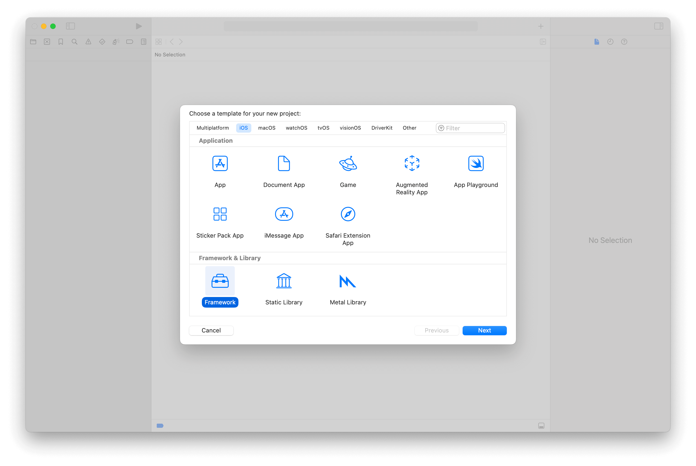
3. entering the information about the package, with the package name being
   `Temp`, and then create

   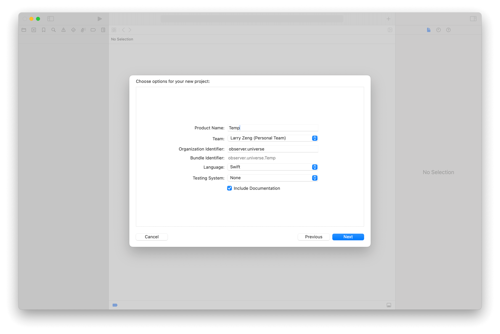
4. copy the `.xcodeproj` to the actual package using something like
   `mv Temp/Temp.xcodeproj ./MyPrivateLib/MyPrivateLib.xcodeproj`.
5. open the XCode project and add the actual sources, libraries, and even test
   targets

   Before:

   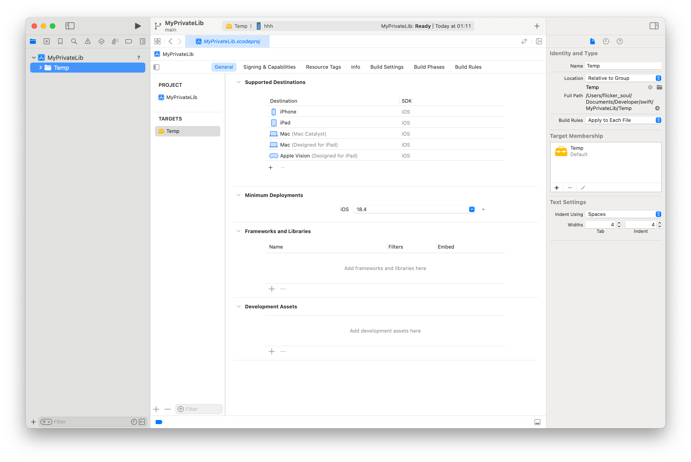

   After:

   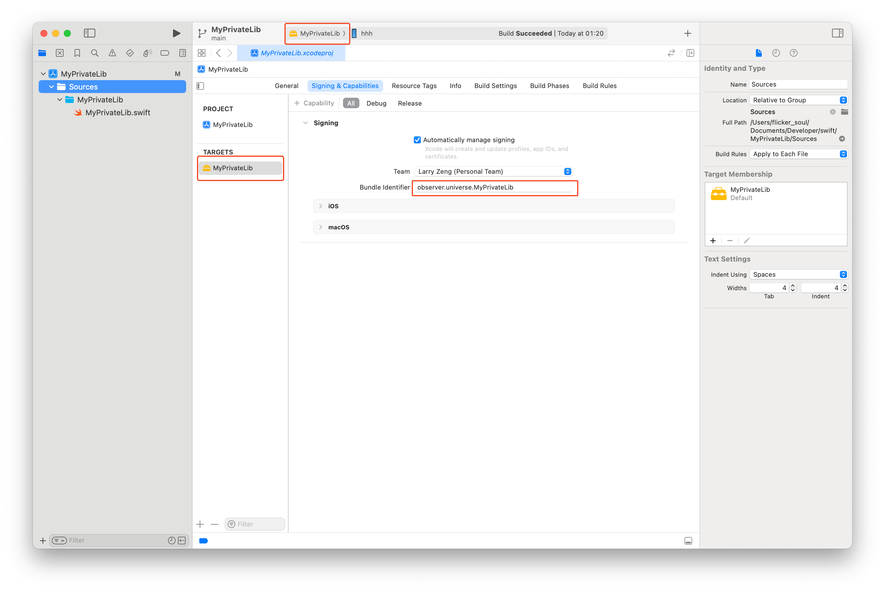
   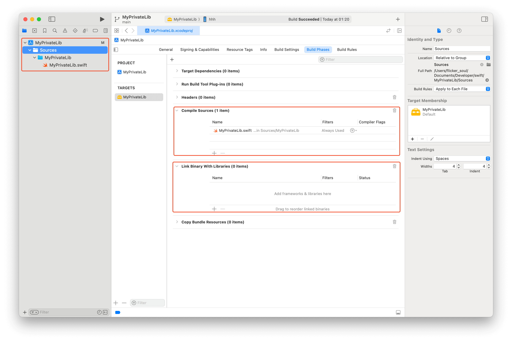

6. verify the project is setup correctly by using the `xcodebuild -list` command
   ```bash
   ❯ xcodebuild -list
   Command line invocation:
       /Applications/Xcode.app/Contents/Developer/usr/bin/xcodebuild -list

   Information about project "MyPrivateLib":
       Targets:
           MyPrivateLib

           Build Configurations:
               Debug
               Release

           If no build configuration is specified and -scheme is not passed then "Release" is used.

           Schemes:
               MyPrivateLib
   ```

After creating a `.xcodeproj` . The project structure looks like
this (where `xcuserdata` folders are omitted):

```text
├── MyPrivateLib.xcodeproj
│   ├── project.pbxproj
│   ├── project.xcworkspace
│   │   ├── contents.xcworkspacedata
│   │   └── xcshareddata
│   │       └── swiftpm
│   │           └── configuration
│   ├── xcshareddata
│   │   └── xcschemes
│   │       └── MyPrivateLib.xcscheme
├── Package.swift
├── scripts
│   ├── build-proj.sh
│   └── set-version.sh
├── Sources
│   └── MyPrivateLib
│       └── MyPrivateLib.swift
└── Tests
    └── MyPrivateLibTests
        └── MyPrivateLibTests.swift
```

Using `.xcodeproj`, we can run `xcodebuild archive`, subsequently
`xcodebuild -create-xcframework`. You can find the script that does
`.xcframework` generation in `scripts/build-proj.sh` under the repository root.
Below is the script I use to build and package the `.xcframework`, which you can
also find in
[the repository](https://github.com/FlickerSoul/MyPrivateLib/blob/main/scripts/build-proj.sh):

```bash
#! /bin/bash

set -e

echo "Building XCFramework..."

export PROJECT_PATH="MyPrivateLib.xcodeproj"
export FRAMEWORK_NAME="MyPrivateLib"
export SCHEME_NAME="MyPrivateLib"
export ARCHIVE_PATH="./.build"
export XCFRAMEWORK_OUTPUT="${ARCHIVE_PATH}/Product"
export XCFRAMEWORK_PATH="${XCFRAMEWORK_OUTPUT}/${FRAMEWORK_NAME}.xcframework"

PLATFORMS=("iOS" "iOS Simulator")

rm -rf "${ARCHIVE_PATH}"
mkdir -p "${ARCHIVE_PATH}"

for PLATFORM in "${PLATFORMS[@]}"; do
    # Replace spaces with hyphens for archive filenames
    SAFE_NAME="${PLATFORM// /-}"

    DEST="generic/platform=${PLATFORM}"
    OUT_ARCHIVE="${ARCHIVE_PATH}/${SAFE_NAME}.xcarchive"

    echo "▸ Archiving for ${PLATFORM} → ${OUT_ARCHIVE}"
    xcodebuild archive \
      -project "${PROJECT_PATH}" \
      -scheme "${SCHEME_NAME}" \
      -configuration "${CONFIGURATION}" \
      -destination "${DEST}" \
      -archivePath "${OUT_ARCHIVE}" \
      -skipPackagePluginValidation \
      -skipMacroValidation \
      SKIP_INSTALL=NO \
      BUILD_LIBRARY_FOR_DISTRIBUTION=YES
done

echo "Building XCFramework Creation Args..."
ARGS=()
for PLATFORM in "${PLATFORMS[@]}"; do
  SAFE_NAME="${PLATFORM// /-}"
  ARCHIVE_FILE="${ARCHIVE_PATH}/${SAFE_NAME}.xcarchive"
  ARGS+=(-archive "${ARCHIVE_FILE}" -framework "${FRAMEWORK_NAME}.framework")
done

echo "Creating XCFramework..."
xcodebuild -create-xcframework \
  "${ARGS[@]}" \
  -output "${XCFRAMEWORK_PATH}"

if [ "$GITHUB_ACTIONS" = "true" ]; then
  # Export the variable for later steps in the workflow
  echo "Export output path to GitHub"
  echo "XCFRAMEWORK_OUTPUT=$(realpath "${XCFRAMEWORK_OUTPUT}")" >> "$GITHUB_ENV"
  echo "XCFRAMEWORK_PATH=$(realpath "${XCFRAMEWORK_PATH}")" >> "$GITHUB_ENV"
fi

echo "XCFramework created successfully at ${XCFRAMEWORK_PATH}"
```

## Release Swift Package Setup

We create another swift package `MyPrivateLibRelease` that will be handed out to
clients and installed in their application. The structure is as the following.

```text
├── Package.swift
└── Sources
    └── MyPrivateLibRelease
        └── MyPrivateLibRelease.swift
```

In seems simple, the `Package.swift` is actually doing the magic, especially the
highlighted area. You can find more
in [the official doc](https://developer.apple.com/documentation/xcode/distributing-binary-frameworks-as-swift-packages).

```swift {13,21-25}
// swift-tools-version: 6.1
// The swift-tools-version declares the minimum version of Swift required to build this package.

import PackageDescription

let package = Package(
    name: "MyPrivateLibRelease",
    products: [
        // Products define the executables and libraries a package produces, making them visible to other packages.
        .library(
            name: "MyPrivateLibRelease",
            targets: ["MyPrivateLibRelease", "MyPrivateLib"]
        ),
    ],
    targets: [
        // Targets are the basic building blocks of a package, defining a module or a test suite.
        // Targets can depend on other targets in this package and products from dependencies.
        .target(
            name: "MyPrivateLibRelease"
        ),
        .binaryTarget(
            name: "MyPrivateLib",
            url: "",
            checksum: ""
        )
    ]
)
```

We want to automatically update the `url` and `checksum` whenever a new release
of our private lib is created.

## GitHub Actions Automating Release Uploading

To automate the release process, we create a GitHub Actions workflow in the
`MyPrivateLib` repository which can be
found [here](https://github.com/FlickerSoul/MyPrivateLib/blob/main/.github/workflows/release.yaml).

The flow essentially does the following steps:

- Build project into `.xcframework` binary
- Sign the binary (If you're not familar with signing, you can check
  out [this post](https://localazy.com/blog/how-to-automatically-sign-macos-apps-using-github-actions)
  and
  the [official document](https://developer.apple.com/documentation/xcode/creating-a-multi-platform-binary-framework-bundle#Sign-the-XCFramework-bundle))
- Calculate the checksum (to be used in the `Package.swift`)
- Calculate the version of this release (usually based on the git tag)
- Draft a new release in the `MyPrivateLibRelease` repository, with the same
  version
- Upload the binary to the release
- Modify `url` to point to the uploaded binary and `checksum` to be the one
  calculated in the previous step, in the `Package.swift` in
  `MyPrivateLibRelease`

Note that, since we are uploading the binary from `MyPrivateLib` to
`MyPrivateLibRelease`, a GitHub personal access token (PAT) is needed, and is
referred as `secrets.BINARY_REPO_TOKEN` in the workflow. The PAT token needs
`Read/Write` permission to `Content` and `Workflow` to create a release, as
per [GitHub document](https://docs.github.com/en/rest/releases/releases?apiVersion=2022-11-28#create-a-release).

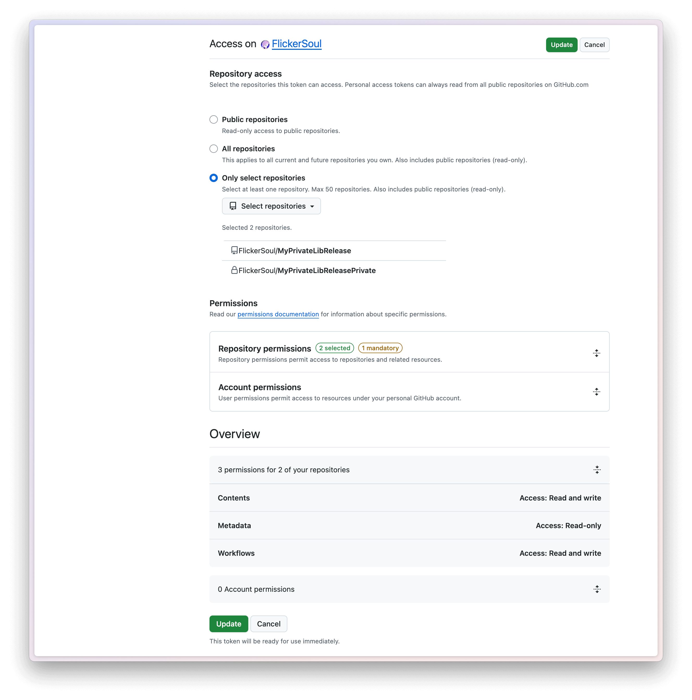
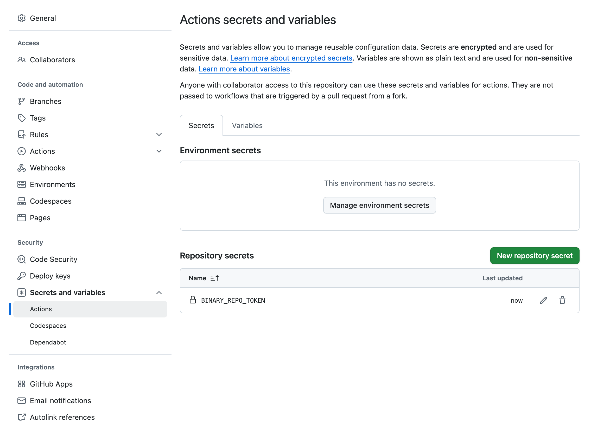

## Try Creating A Release

With this setup, you can then publish your closed-source library through a Swift
package containing the corresponding binary. Whenever a release is created in
the source library (`MyPrivateLib` in this example), a new release will be
automatically created in the binary Swift package.

That is, say a `1.0.0` release is created in `MyPrivateLib`

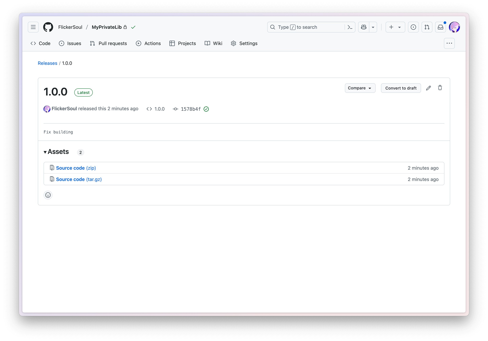

a new commit and a new release will be created in the `MyPrivateLibRelease` repo

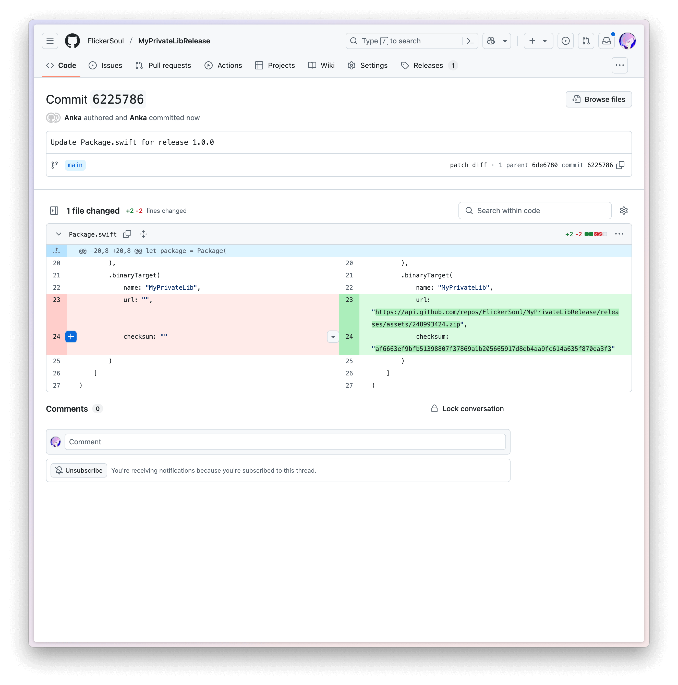
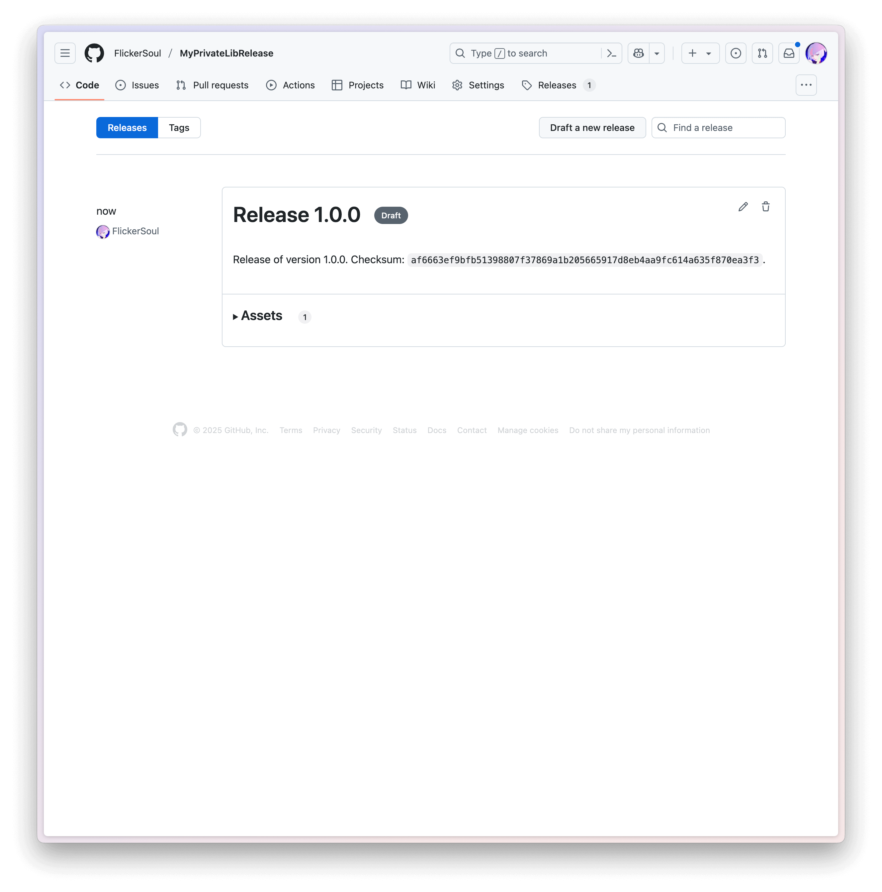

You can notice that release `MyPrivateLibRelease` is a draft release. This is
done on purpose to prevent accidental release or unchecked mistakes. You
manually edit the release to publish it, or add
`gh release edit <release_name> --draft=false` to publish it automatically.

## Use The Binary Swift Package

After adding the binary swift package `MyPrivateLibRelease` to the package
manager, you can import and use `MyPrivateLib` like how normally you would do.
For instance,

```swift
import MyPrivateLib // Note that it's not `import MyPrivateLibRelease`.
import SwiftUI

ContentView: View {
    @State var output = ""
    var body: some View {
        List {
            Text(output)
            Button("Update Output") {
                output = "\(myPublicFunction())"
            }
        }
    }
}
```

## Bonus: Private Release Repository

In my use case, the binary Swift package is private, and only the selected
clients
have access to it. I created `MyPrivateLibReleasePrivate` as an illustration,
which is published using a copy of the same workflow above. For clients to
access such private release repository, a read PAT is needed, with a
read-only `Content` permission.

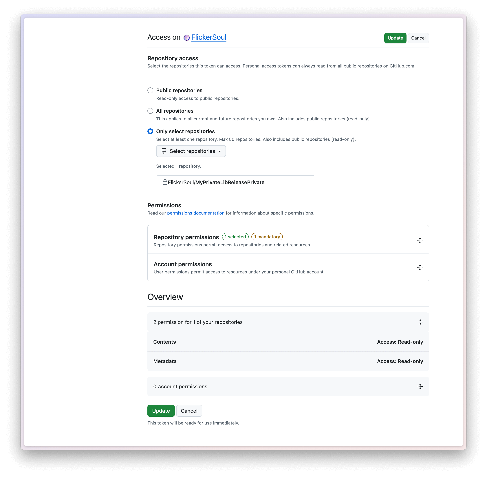

To let XCode know how to authenticate itself to access the private release
repository, the client needs to create a `.netrc` under their home directory (
that is, `~/.netrc`),
with the following content, where `<username>` is the username from which the
PAT is generated.

```text
machine api.github.com
  login <username>
  password <PAT>
```

To access the `MyPrivateLibReleasePrivate` repo, you can try with the following
the token
`11ADF5YFA0Eaqlx54U0TJ3_b91EiJVRLmR0IunzI10l7Tp9ktzBJR1CxSQ8hRJ11GPX4LG7ZSM2pFKyRWX`
by prefixing `github_pat_` to it.

```text
machine api.github.com
  login FlickerSoul
  password <PAT>
```
