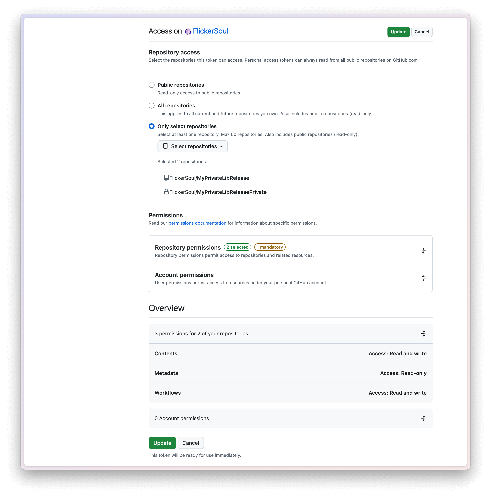
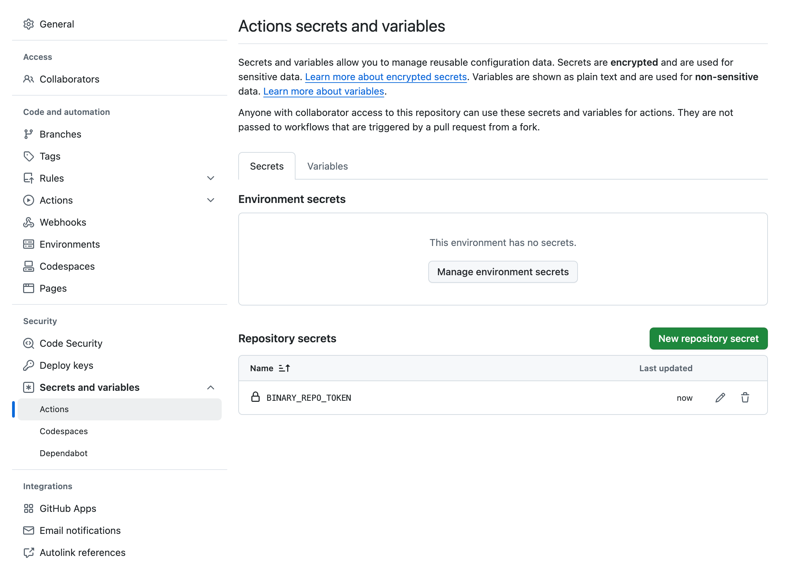
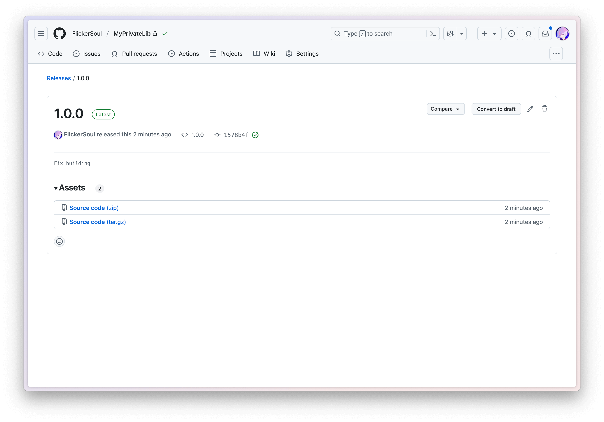
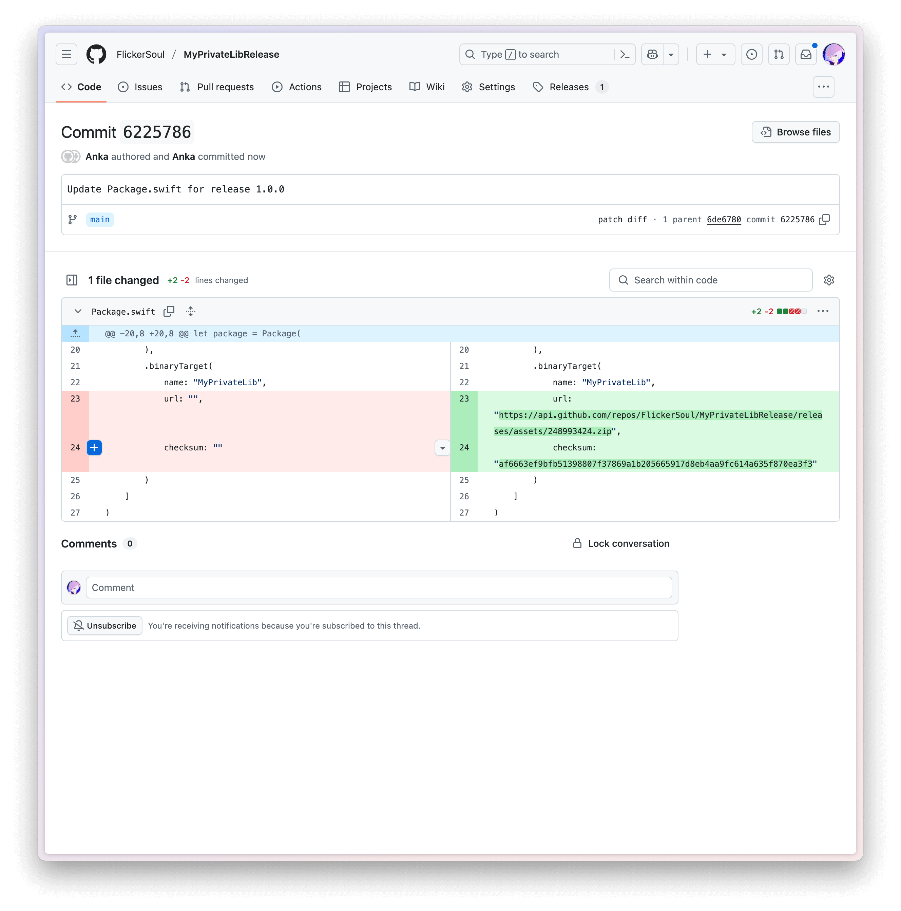
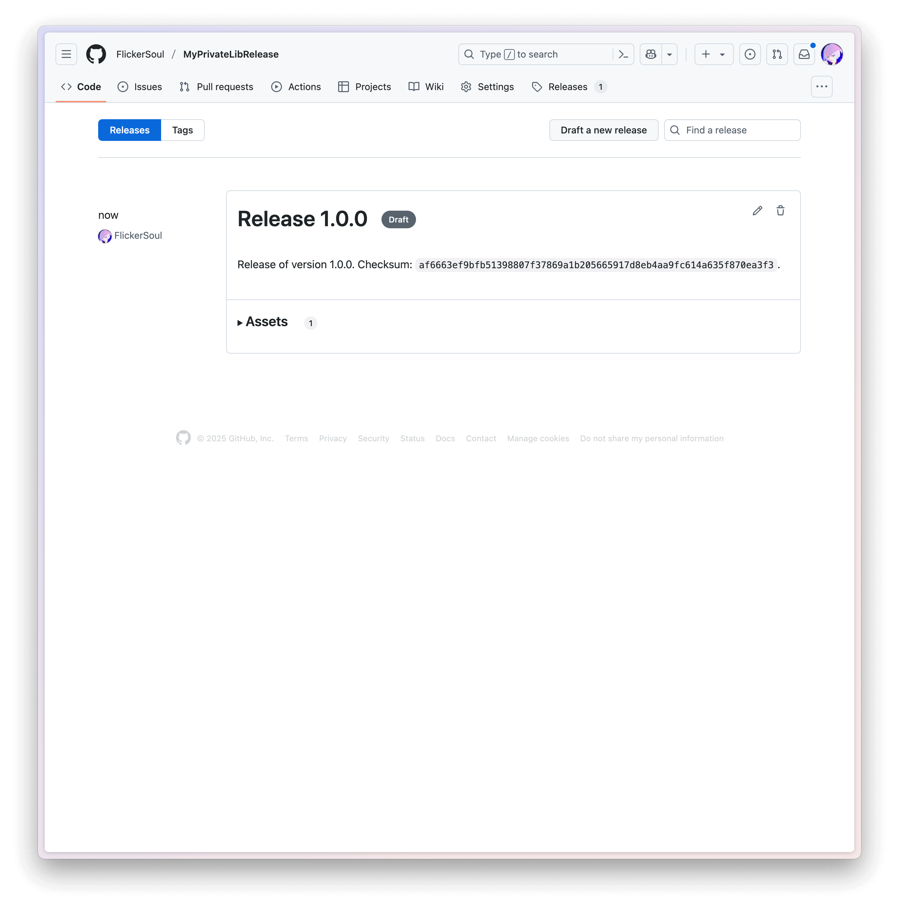
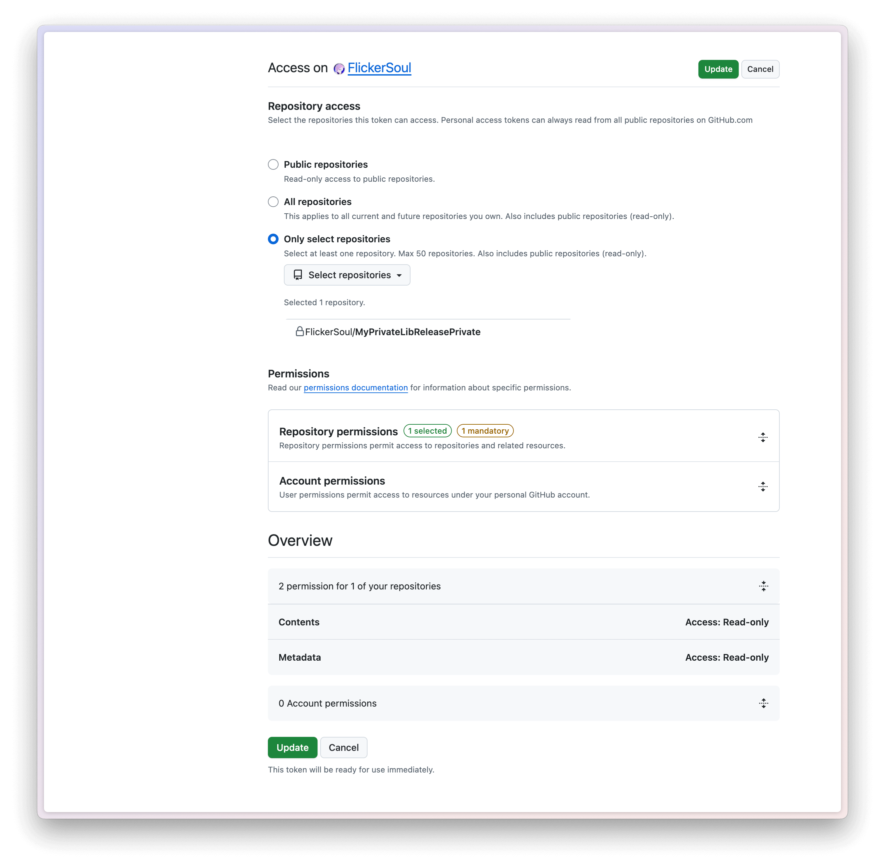

I have a problem where I need to automate publishing a (private) Swift package
of a `.xcframework` built from a private library/SDK.

<!-- more --> 

[[TOC]]

## Background

A quick rant before I begin: I've been working as an iOS dev for some
time and this sentence
from [a hacker news post](https://news.ycombinator.com/item?id=39845625)
captures my feeling perfectly: "My time as an
Apple developer left me with the overwhelming sensation that Apple hates its
developers. So much cool looking stuff that mostly worked..."  
This shall be the first of many posts
where I share my experience of working on the unknown pits in swift, which I
hope will help other people along the way to be less frustrated.

Back to the subject.

I was helping my company develop an closed-source,
iOS-only SDK/library in Swift
that will be shared only to a selected number of clients. I needed to figure out
a way to automate building the closed-source swift
package into binaries (`.xcframework` in this case), and distribute them as a
private Swift package repository. Since our company uses GitHub, I used
GitHub actions to automate this process, and host the binary in GitHub Releases.

Distributing open-source Swift package is easy: publish your package in
a source control repository, as described
in [this official doc](https://developer.apple.com/documentation/xcode/adding-package-dependencies-to-your-app)
from apple.

For closed-source libraries, we can first compile the libraries into
binaries,
and [distribute binaries as swift package with some setup](https://developer.apple.com/documentation/xcode/distributing-binary-frameworks-as-swift-packages).
This means we will need to manage three entities, the repository of source of
the private library, the binary of the private library, and another repository
that publishes the binary.

Let's work on a concrete example, where I'm trying to publish a `.xcframework` from a private library `MyPrivateLib`.
There are two publishing destinations, `MyPrivateLibRelease` which is public, and `MyPrivateLibReleasePrivate` which is
private. The former is a public repository that's accessible to all clients, and the latter is a private repository for
clients that have access to the private repository via GitHub personal access token (PAT).

You can find the source code and GitHub
actions of the automation in these repositories:

- [`MyPrivateLib`](https://github.com/FlickerSoul/MyPrivateLib)
- [`MyPrivateLibRelease`](https://github.com/FlickerSoul/MyPrivateLibRelease)
- [
  `MyPrivateLibReleasePrivate`](https://github.com/FlickerSoul/MyPrivateLibReleasePrivate)

## Private SDK Setup

Suppose we are developing a closed-source swift package, `MyPrivateLib`, which
has
a basic structure:

```text
├── Package.swift
├── Sources
│   └── MyPrivateLib
│       └── MyPrivateLib.swift
└── Tests
    └── MyPrivateLibTests
        └── MyPrivateLibTests.swift
```

The library functionality is also basic:

```swift
func mySecretFunction() -> Int {
    return Int.random(in: 1...100)
}

public func myPublicFunction() -> Int {
    mySecretFunction()
}
```

## Building Binary

From my search on the internet, it's impossible to create a `.xcframework`
without adding an additional `.xcodeproj` with a
`Framework` target (__not__ `Library` target). The easiest way I found to create
a `.xcodeproj` for a swift package is by using [`tuist`](https://tuist.io).

1. install `tuist` via its [installation doc](https://docs.tuist.dev/en/guides/install-tuist).
2. add a `Tuist.swift` file in the root of the repository to indicate we are using `tuist`:
    ```swift
    import ProjectDescription

    let config = Config(
        project: .tuist(),
    )
    ```
3. add a `Project.swift` like the following to generate a `.xcodeproj` with a `Framework` target from the main source
   folder, `Sources/MyPrivateLib`. You can also add your `*.docc` to the `sources` argument if you have any
   documentation.

    ```swift
    import ProjectDescription

    let project = Project(
        name: "MyPrivateLib",
        targets: [
            .target(
                name: "MyPrivateLib",
                destinations: .iOS,
                product: .framework,
                bundleId: "observer.universe.MyPrivateLib",
                deploymentTargets: .iOS("13.0"),
                sources: ["Sources/MyPrivateLib/**/*.swift"],
                settings: .settings(base: [
                    "SWIFT_VERSION": "6.0",
                    "SKIP_INSTALL": "NO",
                    "BUILD_LIBRARY_FOR_DISTRIBUTION": "YES",
                    "CODE_SIGN_IDENTITY": "",
                    "CODE_SIGN_STYLE": "Manual",
                ]),
            ),
            .target(
                name: "MyPrivateLibTests",
                destinations: .iOS,
                product: .unitTests,
                bundleId: "observer.universe.MyPrivateLibTests",
                deploymentTargets: .iOS("13.0"),
                sources: ["Tests/MyPrivateLibTests/**/*.swift"],
                dependencies: [
                    .target(name: "MyPrivateLib"),
                ],
            ),
        ],
    )
    ```
4. run `tuist install` and `tuist generate` to generate the `.xcodeproj` file. You can add `--no-open` to prevent it
   from opening the project in XCode, which is what we are going to use in our CI.

After running `tuist generate`, a `.xcodeproj` is created locally. The full repository structure should be as the
following.

Note that `MyPrivateLib.xcodeproj` is going to always be generated by `tuist`, so it should be added to
`.gitignore`, and should not be committed to the repository. So are `MyPrivateLib.xcworkspace` and `Derived`.

```text
.
├── MyPrivateLib.xcodeproj
│   ├── project.xcworkspace
│   │   ├── xcshareddata
│   │   │   └── swiftpm
│   │   │       └── configuration
│   │   └── xcuserdata
│   │       └── flicker_soul.xcuserdatad
│   │           ├── UserInterfaceState.xcuserstate
│   │           └── xcschemes
│   │               └── xcschememanagement.plist
│   └── xcuserdata
│       └── flicker_soul.xcuserdatad
│           └── xcschemes
│               ├── Temp.xcscheme
│               └── xcschememanagement.plist
├── Package.swift
├── Project.swift
├── README.md
├── Sources
│   └── MyPrivateLib
│       └── MyPrivateLib.swift
├── Tests
│   └── MyPrivateLibTests
│       └── MyPrivateLibTests.swift
├── Tuist.swift
└── .gitignore
```

Using `.xcodeproj`, we can run `xcodebuild archive`, subsequently
`xcodebuild -create-xcframework`. Below is the main python script that automates the process of building
`.xcframework`. It and its helper support can be found here in the scripts folder [
`scripts`](https://github.com/FlickerSoul/MyPrivateLib/blob/main/scripts/)
in the repository:

```python
#!/usr/bin/env python3
"""Build the MyPrivateLib XCFramework."""

import os
import shutil
import subprocess
import sys

from sdk_tools import REPO_ROOT
from sdk_tools.process import xcbeautify_piped_exit_on_failure
from sdk_tools.version import get_sdk_version


def install_tuist() -> None:
    print("Installing Tuist...")
    for cmd in [
        ["brew", "tap", "--quiet", "tuist/tuist"],
        ["brew", "install", "--quiet", "--formula", "tuist"],
    ]:
        result = subprocess.run(cmd)
        if result.returncode != 0:
            print(f"Command {cmd} failed with exit code {result.returncode}")
            sys.exit(result.returncode)


def tuist_setup() -> None:
    print("Installing dependencies via Tuist...")
    for cmd, label in [
        (["tuist", "install"], "tuist install"),
        (["tuist", "generate", "--no-open"], "tuist generate"),
    ]:
        result = subprocess.Popen(cmd, cwd=REPO_ROOT)
        result.wait()
        if result.returncode != 0:
            print(f"{label} failed with exit code {result.returncode}")
            sys.exit(result.returncode)


def compute_checksum(zip_path: str) -> str:
    result = subprocess.run(
        ["xcrun", "swift", "package", "compute-checksum", zip_path],
        capture_output=True,
        text=True,
    )
    if result.returncode != 0:
        print(f"compute-checksum failed: {result.stderr}")
        sys.exit(result.returncode)
    checksum = result.stdout.strip()
    print(f"Checksum: {checksum}")
    return checksum


def main() -> None:
    sdk_version = get_sdk_version()
    print(f"Building XCFramework For Version '{sdk_version}'...")

    framework_name = "MyPrivateLib"
    scheme_name = "MyPrivateLib"
    archive_path = REPO_ROOT / ".build"
    product_output = archive_path / "Product"
    xcframework_path = product_output / f"{framework_name}-{sdk_version}.xcframework"

    if archive_path.exists():
        shutil.rmtree(archive_path)
    archive_path.mkdir(parents=True)

    install_tuist()
    tuist_setup()

    common_args = [
        "-project", "MyPrivateLib.xcodeproj",
        "-configuration", "Release",
        "-scheme", scheme_name,
        "-skipPackagePluginValidation",
        "-skipMacroValidation",
    ]

    destinations = [
        ("iOS", "generic/platform=iOS"),
        ("iOS-Simulator", "generic/platform=iOS Simulator"),
    ]

    for archive_name, destination in destinations:
        print(f"Archiving for {archive_name}...")
        xcbeautify_piped_exit_on_failure([
            "xcodebuild", "archive",
            *common_args,
            "-destination", destination,
            "-archivePath", str(archive_path / f"{archive_name}.xcarchive"),
        ])

    print("Creating XCFramework...")
    product_output.mkdir(parents=True, exist_ok=True)
    xcframework_args = []
    for archive_name, _ in destinations:
        xcframework_args += [
            "-archive", str(archive_path / f"{archive_name}.xcarchive"),
            "-framework", f"{framework_name}.framework",
        ]
    xcbeautify_piped_exit_on_failure([
        "xcodebuild", "-create-xcframework",
        *xcframework_args,
        "-output", str(xcframework_path),
    ])

    if keychain_path := os.environ.get("KEYCHAIN_PATH"):
        print("Signing XCFramework...")
        result = subprocess.run([
            "codesign", "--timestamp",
            "--keychain", keychain_path,
            "-s", "Apple Distribution",
            str(xcframework_path),
        ])
        if result.returncode != 0:
            print(f"codesign failed with exit code {result.returncode}")
            sys.exit(result.returncode)
    else:
        print("KEYCHAIN_PATH not set, skipping XCFramework signing.")

    print("Zipping XCFramework...")
    xcframework_zip_path = shutil.make_archive(
        base_name=str(product_output / f"{framework_name}-{sdk_version}.xcframework"),
        format="zip",
        root_dir=str(product_output),
        base_dir=xcframework_path.name,
    )

    xcframework_zip_checksum = compute_checksum(xcframework_zip_path)

    if os.environ.get("GITHUB_ACTIONS") == "true":
        print("Export output paths to GitHub")
        github_env = os.environ["GITHUB_ENV"]
        with open(github_env, "a") as f:
            f.write(f"XCFRAMEWORK_PATH={xcframework_path}\n")
            f.write(f"XCFRAMEWORK_ZIP_OUTPUT={xcframework_zip_path}\n")
            f.write(f"XCFRAMEWORK_ZIP_CHECKSUM={xcframework_zip_checksum}\n")

    print(f"XCFramework created successfully at {xcframework_path}")
    print(f"XCFramework zip: {xcframework_zip_path}")


if __name__ == "__main__":
    main()
```

## Release Swift Package Setup

We create another swift package `MyPrivateLibRelease` that will be handed out to
clients and installed in their application. The structure is as the following.

```text
├── Package.swift
└── Sources
    └── MyPrivateLibRelease
        └── MyPrivateLibRelease.swift
```

The structure feels trivial, because the `Package.swift` is actually doing the
magic, especially in the following highlighted area. You can find more
in [the official doc](https://developer.apple.com/documentation/xcode/distributing-binary-frameworks-as-swift-packages).

```swift {12,21-25}
// swift-tools-version: 6.1
// The swift-tools-version declares the minimum version of Swift required to build this package.

import PackageDescription

let package = Package(
    name: "MyPrivateLibRelease",
    products: [
        // Products define the executables and libraries a package produces, making them visible to other packages.
        .library(
            name: "MyPrivateLibRelease",
            targets: ["MyPrivateLibRelease", "MyPrivateLib"]
        ),
    ],
    targets: [
        // Targets are the basic building blocks of a package, defining a module or a test suite.
        // Targets can depend on other targets in this package and products from dependencies.
        .target(
            name: "MyPrivateLibRelease"
        ),
        .binaryTarget(
            name: "MyPrivateLib",
            url: "https://example.com/framework-missing.zip",
            checksum: "71e1fae8fc231fe8f85cc5db2ba9a78661897e461d376ce7582b2ae8c113b1a7"
        )
    ]
)
```

Whenever a new release of our closed-source library is created, we want to
update the `url` and `checksum` to match the corresponding new release.

For now, we are using a placeholder url and checksum, which will be updated in the CI later.

## GitHub Actions Automating Release Uploading

To automate the release process, we create a GitHub Actions workflow in the
`MyPrivateLib` repository which can be
found [here](https://github.com/FlickerSoul/MyPrivateLib/blob/main/.github/workflows/release.yaml).

The flow essentially does the following steps:

- Build project into `.xcframework` binary
- Sign the binary (If you're not familiar with signing, you can check
  out [this post](https://localazy.com/blog/how-to-automatically-sign-macos-apps-using-github-actions)
  and
  the [official document](https://developer.apple.com/documentation/xcode/creating-a-multi-platform-binary-framework-bundle#Sign-the-XCFramework-bundle))
- Calculate the checksum (to be used in the `Package.swift`)
- Calculate the version of this release (usually based on the git tag)
- Draft a new release in the `MyPrivateLibRelease` repository, with the same
  version
- Upload the binary to the release
- Modify `url` to point to the uploaded binary and `checksum` to be the one
  calculated in the previous step, in the `Package.swift` in
  `MyPrivateLibRelease`

The checksum calculation and the drafting a new release is done with the following python script, which can also be
found in the scripts folder [here](https://github.com/FlickerSoul/MyPrivateLib/blob/main/scripts/).

Note that, since we are uploading the binary from `MyPrivateLib` to
`MyPrivateLibRelease`, a GitHub personal access token (PAT) is needed, and is
referred as `secrets.BINARY_REPO_TOKEN` in the workflow. The PAT token needs
`Read/Write` permission to `Content` and `Workflow` to create a release, as
per [GitHub document](https://docs.github.com/en/rest/releases/releases?apiVersion=2022-11-28#create-a-release).




```python
#!/usr/bin/env python3
"""Create a draft release on the binary release repository and update Package.swift."""

import json
import os
import subprocess
import sys
from pathlib import Path
from typing import Optional

from sdk_tools import REPO_ROOT


BINARY_REPO_DIR = REPO_ROOT / "binary-repo"


def run(cmd: list[str], cwd: Optional[Path] = None, capture_output: bool = False) -> subprocess.CompletedProcess:
    result = subprocess.run(cmd, cwd=cwd, capture_output=capture_output, text=True)
    if result.returncode != 0:
        if capture_output:
            print(result.stderr, file=sys.stderr)
        sys.exit(result.returncode)
    return result


def create_draft_release(binary_repo: str, version: str, xcframework_zip: str, checksum: str) -> None:
    print(f"Creating draft release {version} on {binary_repo}...")
    run([
        "gh", "release", "create", version,
        xcframework_zip,
        "--repo", binary_repo,
        "--title", f"Release {version}",
        "--notes", f"Release of version {version}.\n Checksum: `{checksum}`.",
        "--draft",
    ])


def get_asset_url(binary_repo: str, version: str) -> str:
    print("Fetching asset URL from draft release...")
    result = run(
        ["gh", "release", "view", version, "--repo", binary_repo, "--json", "assets"],
        capture_output=True,
    )
    assets = json.loads(result.stdout)["assets"]
    xcframework_asset = next((a for a in assets if a["name"].endswith(".xcframework.zip")), None)
    if xcframework_asset is None:
        names = [a["name"] for a in assets]
        print(f"Error: no *.xcframework.zip asset found in release assets: {names}", file=sys.stderr)
        sys.exit(1)
    url = xcframework_asset["apiUrl"] + ".zip"
    print(f"Asset URL: {url}")
    return url


TARGET_NAME = "MyPrivateLib"


def update_package_swift(asset_url: str, checksum: str) -> None:
    package_swift = BINARY_REPO_DIR / "Package.swift"
    print(f"Updating {package_swift}...")

    result = run(["swift", "package", "dump-package"], cwd=BINARY_REPO_DIR, capture_output=True)
    package_json = json.loads(result.stdout)
    target = next((t for t in package_json["targets"] if t["name"] == TARGET_NAME), None)
    if target is None:
        names = [t["name"] for t in package_json["targets"]]
        print(f"Error: target '{TARGET_NAME}' not found in Package.swift. Found: {names}", file=sys.stderr)
        sys.exit(1)

    current_url: str = target["url"]
    current_checksum: str = target["checksum"]

    content = package_swift.read_text()
    content = content.replace(current_url, asset_url)
    content = content.replace(current_checksum, checksum)
    package_swift.write_text(content)


def commit_and_tag(version: str) -> str:
    print("Committing Package.swift update...")
    run(["git", "config", "user.email", "app@universe.observer"], cwd=BINARY_REPO_DIR)
    run(["git", "config", "user.name", "MyPrivateLib App"], cwd=BINARY_REPO_DIR)
    run(["git", "add", "Package.swift"], cwd=BINARY_REPO_DIR)
    run(["git", "commit", "-m", f"Update Package.swift for release {version}"], cwd=BINARY_REPO_DIR)

    print(f"Creating tag {version} and pushing...")
    run(["git", "tag", version], cwd=BINARY_REPO_DIR)
    run(["git", "push", "--set-upstream", "origin", "main"], cwd=BINARY_REPO_DIR)
    run(["git", "push", "origin", "main"], cwd=BINARY_REPO_DIR)

    result = run(["git", "rev-parse", "HEAD"], cwd=BINARY_REPO_DIR, capture_output=True)
    return result.stdout.strip()


def update_release_target(binary_repo: str, version: str, commit_sha: str) -> None:
    print(f"Updating draft release target to commit {commit_sha}...")
    run([
        "gh", "release", "edit", version,
        "--repo", binary_repo,
        "--target", commit_sha,
    ])


def main() -> None:
    binary_repo = os.environ.get("RELEASE_REPO")
    version = os.environ.get("SDK_VERSION")
    xcframework_zip = os.environ.get("XCFRAMEWORK_ZIP_OUTPUT")
    checksum = os.environ.get("XCFRAMEWORK_ZIP_CHECKSUM")

    missing = [
        name for name, val in [
            ("RELEASE_REPO", binary_repo),
            ("SDK_VERSION", version),
            ("XCFRAMEWORK_ZIP_OUTPUT", xcframework_zip),
            ("XCFRAMEWORK_ZIP_CHECKSUM", checksum),
        ] if not val
    ]
    if missing:
        print(f"Error: missing required environment variables: {', '.join(missing)}", file=sys.stderr)
        sys.exit(1)

    errors: list[str] = []

    xcframework_path = Path(xcframework_zip)
    if not xcframework_path.name.endswith(".xcframework.zip"):
        errors.append(f"XCFRAMEWORK_ZIP_OUTPUT filename must end with '.xcframework.zip', got '{xcframework_path.name}'")
    if not xcframework_path.exists():
        errors.append(f"XCFRAMEWORK_ZIP_OUTPUT does not exist: {xcframework_zip}")

    if errors:
        for error in errors:
            print(f"Error: {error}", file=sys.stderr)
        sys.exit(1)

    create_draft_release(binary_repo, version, xcframework_zip, checksum)
    asset_url = get_asset_url(binary_repo, version)
    update_package_swift(asset_url, checksum)
    commit_sha = commit_and_tag(version)
    update_release_target(binary_repo, version, commit_sha)

    print("Release upload complete.")


if __name__ == "__main__":
    main()
```

## Try Creating A Release

With this setup, you can then publish your closed-source library through a Swift
package containing the corresponding binary. Whenever a release is created in
the source library (`MyPrivateLib` in this example), a new release will be
automatically created in the binary Swift package (`MyPrivateLibRelease` in this case).

That is, say when a `1.0.0` release is created in `MyPrivateLib`,



we can observe that a new commit and a new release will be created in the
`MyPrivateLibRelease` repo, after the CI is run




You can notice that release `MyPrivateLibRelease` is a draft release. This is
done on purpose to prevent accidental release or unchecked mistakes. You
manually edit the release to publish it, or add
`gh release edit <release_name> --draft=false` to publish it automatically. Once
the release is published, the user of this package can see this new version and
use it.

## Use The Binary Swift Package

After adding the binary swift package `MyPrivateLibRelease` to the package
manager, you can import and use `MyPrivateLib` like how normally you would do.
For instance,

```swift
import MyPrivateLib // Note that it's not `import MyPrivateLibRelease`.
import SwiftUI

ContentView: View {
    @State var output = ""
    var body: some View {
        List {
            Text(output)
            Button("Update Output") {
                output = "\(myPublicFunction())"
            }
        }
    }
}
```

## Bonus: Private Release Repository

In my use case, the binary Swift package is private, and only the selected
clients
have access to it. I created `MyPrivateLibReleasePrivate` as an illustration,
which is published using a copy of the same workflow above. For clients to
access such private release repository, a read PAT is needed, with a
read-only `Content` permission.



To let XCode know how to authenticate itself to access the binary in the GitHub
Release of the private repository, the client needs to create a `.netrc` under
their home directory (that is, `~/.netrc`),
with the following content, where `<username>` is the username from which the
PAT is generated.

```text
machine api.github.com
  login <username>
  password <PAT>
```

For more information about why `.netrc` is needed,
see [this post](https://forums.swift.org/t/spm-support-basic-auth-for-non-git-binary-dependency-hosts/37878).

To access the `MyPrivateLibReleasePrivate` repo, you can try with the following
the token
`11ADF5YFA0Eaqlx54U0TJ3_b91EiJVRLmR0IunzI10l7Tp9ktzBJR1CxSQ8hRJ11GPX4LG7ZSM2pFKyRWX`
by prefixing `github_pat_` to it.

```text
machine api.github.com
  login FlickerSoul
  password <PAT>
```
