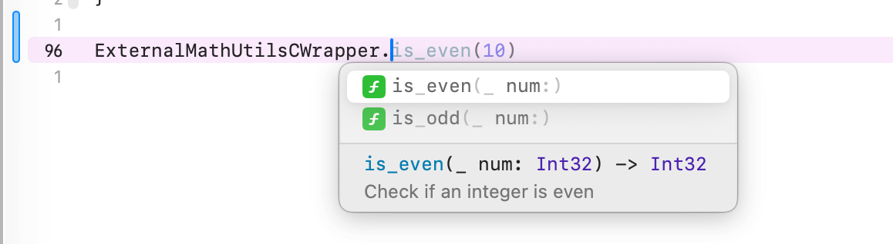
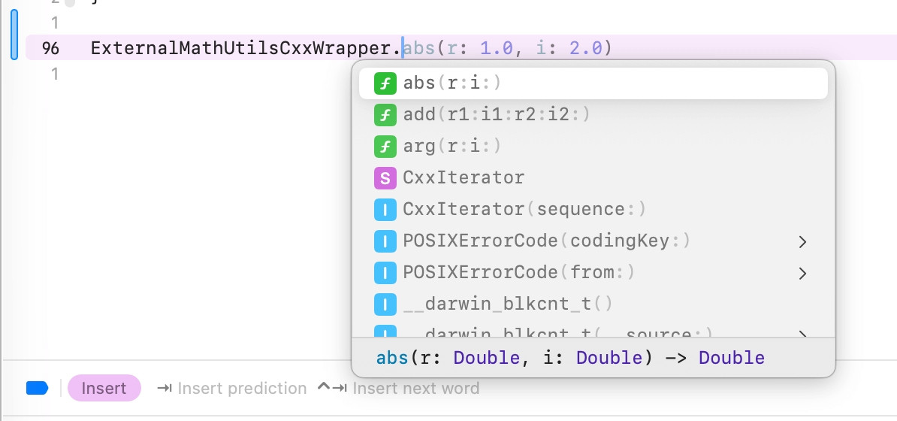

Swift package with C/++ interoperation example

<!-- more --> 

[[TOC]]

## Background

Apple introduced C++ interoperation back in WWDC 2023 (wow that's two years ago
already). C and objective C has been interoperable with Swift for a long time
and this capability adds more to the game.

I recently ran into this feature
because I need to integrate a C package and some of my own C++ code into the
existing iOS application to do audio processing. The C package is distributed as
a static library with a couple of `.a` files and a set of header files. My goal
is to build interface with two C/++ functions:

- takes two strings, one is the input file path, and the other is output file
  path
- takes one `Data` (or `[UInt8]`) and returns a `Data` (or `[UInt8]`)

Apple provides an example project that interoperates Swift with C++ but my use
case would be best solved by packing a swift package of many targets. This leads
to the writing of this blog, documenting how one can bundle C/++ code or static
library along with Swift code into a swift package.

You can find the complete example Swift
package source
code [here](https://github.com/FlickerSoul/SwiftPackageCxxCInterop).

I also find the following sources helpful:

- https://www.swift.org/documentation/cxx-interop/
- https://developer.apple.com/videos/play/wwdc2023/10172/
- https://www.youtube.com/watch?v=jcNxtM_yTfk
- https://developer.apple.com/documentation/swift/mixinglanguagesinanxcodeproject

Side note: in WWDC 2025, Apple introduces safe interoperation using `Span` and
`MutableSpan`. They are helpful in preventing access-after-free and
access-out-of-bound memory issues, which we will not touch much in this post (
because I didn't get it working in the beta SDK...; I'll put my exploration at
the end).

- https://www.swift.org/documentation/cxx-interop/safe-interop/
- https://forums.swift.org/t/accessing-underlying-memory-of-data-in-c-with-new-span-apis/80403

## Project Structure

Under the `MathUtils.swift` folder, you can find the following package
structure.

```text
.
├── Package.swift
├── Sources
│   ├── ExternalMathUtilsC
│   │   ├── include
│   │   │   └── math_utils.h
│   │   ├── lib
│   │   │   └── libmath_utils.a
│   │   ├── math_utils.pk
│   │   └── module.modulemap
│   ├── ExternalMathUtilsCxx
│   │   ├── include
│   │   │   └── complex_math.h
│   │   ├── lib
│   │   │   └── libcomplexmath.a
│   │   └── module.modulemap
│   ├── MathUtils
│   │   └── MathUtils.swift
│   ├── MathUtilsC
│   │   ├── cipher_kit.c
│   │   └── include
│   │       ├── cipher_kit.h
│   │       └── module.modulemap
│   ├── MathUtilsCxx
│   │   ├── include
│   │   │   ├── MathUtilsCxx.hpp
│   │   │   └── module.modulemap
│   │   └── MathUtilsCxx.cpp
│   └── MathUtilsExecutable
│       └── MathUtilsExecutable.swift
└── Tests
    └── MathUtilsTests
        └── MathUtilsTests.swift
```

## The C/++ Static Library Binary

Suppose I was given two static libraries, one in C and one in C++, under the
`ExternalMathUtilsC` and `ExternalMathUtilsCxx`. Each of them has a `.a` and a
`.h` file. Their source code can be found in the two
folders from the parent folder of the swift
package. ([here](https://github.com/FlickerSoul/SwiftPackageCxxCInterop/tree/main/MathUtilsC)
and [here](https://github.com/FlickerSoul/SwiftPackageCxxCInterop/tree/main/MathUtilsCxx)).

The static libraries do simple math tasks. All functions are listed
below (we will talk about `SWIFT_NAME` later), and we are going to bridge them
into Swift.

```c++
// C functions
int is_even(int num);
int is_odd(int num);

// C++ functions
std::complex<double> complex_addition(double real1, double imag1, double real2, double imag2) SWIFT_NAME(add(r1:i1:r2:i2:));
double complex_abs(double real, double imag) SWIFT_NAME(abs(r:i:));
double complex_arg(double real, double imag) SWIFT_NAME(arg(r:i:));
```

In reality, it might be not elegant or possible to copy the static library to
the Swift package. From my limited testing, creating soft links in the Swift
package pointing to the actual static libraries (which, for instance, can be in
a git submodule in a different location) will also work. The `.a` files don't
even need to be in the swift package directory, as we will see later, but I
found it's easier to manage when I have a soft link of the `.a` files in the
package.

## The Bridging: `module.modulemap` and `math_utils.pk`

To bridge the static libraries, we use the [
`.systemLibrary`](https://developer.apple.com/documentation/packagedescription/target/systemlibrary(name:path:pkgconfig:providers:))
to let Swift package know where the static libraries are.

```swift
// swift-tools-version: 6.2
import PackageDescription

struct Lib {
    let base: String
    let pkName: String?
    
    var include: String {
        return "\(base)/include"
    }
    
    var lib: String {
        return "\(base)/lib"
    }
    
    var pkgConfig: String? {
        return pkName.map { "\(base)/\($0)" }
    }
}

let packageDirectory = Context.packageDirectory
let externalMathUtilsC = Lib(base: "\(packageDirectory)/Sources/ExternalMathUtilsC", pkName: "math_utils.pk")
let externalMathUtilsCxx = Lib(base: "\(packageDirectory)/Sources/ExternalMathUtilsCxx", pkName: nil)

let package = Package(
    name: "MathUtils.swift",
    // omitted ...
    targets: [
        .systemLibrary(name: "ExternalMathUtilsC", pkgConfig: externalMathUtilsC.pkgConfig),
        .systemLibrary(name: "ExternalMathUtilsCxx", pkgConfig: externalMathUtilsCxx.pkgConfig),
        // omitted...
    ],
    cLanguageStandard: .c17,
    cxxLanguageStandard: .cxx17
)
```

It's not enough to have the `.h` header files in the package, as you can see in
the file tree structure. Two kinds of files were added: `module.modulemap` and
`.pk` pkg config. Since standard C and C++ don't have the notion of module,
`module.modulemap` helps Swift understand what modules this library has during
import. The `.pk` configs help the compiler figure where to find the header
files, and seems mandatory for C libraries. You can also add `.pk` configs to
the C++ libraries to minimize the linking configurations in `Package.swift`.

```text {6,7,13}
│   ├── ExternalMathUtilsC
│   │   ├── include
│   │   │   └── math_utils.h
│   │   ├── lib
│   │   │   └── libmath_utils.a
│   │   ├── math_utils.pk
│   │   └── module.modulemap
│   ├── ExternalMathUtilsCxx
│   │   ├── include
│   │   │   └── complex_math.h
│   │   ├── lib
│   │   │   └── libcomplexmath.a
│   │   └── module.modulemap
```

If you remove the `.pk` file in the C library, the compiler will prompt you that
it cannot find the header files. If you remove the `module.modulemap` file, the
package manager will prompt you that
`package has unsupported layout; missing system target module map at '/.../MathUtils.swift/Sources/ExternalMathUtilsC/module.modulemap'`

I didn't spend too much time figuring out how `module.modulemap` and `.pk` works
beyond basic usage. In my use case, for `module.modulemap`, simply including all
the headers in the library and
blindly exporting all by `export *` did the trick. If you're interested in more
details, I asked Claude to search for some tips
in [here](https://claude.ai/public/artifacts/0cdd3391-4ee7-443a-ad87-90540bce01de).

```
module ExternalMathUtilsCWrapper {
    header "include/math_utils.h"

    export *
}

module ExternalMathUtilsCxxWrapper {
    header "include/complex_math.h"

    export *
}
```

For `.pk` configs, AI seems pretty good at generating one. The following is
a basic one I've been using, which essentially gets the directory of the static
library (where the `.pk` config is located), and uses `-I` flag to help locating
the header files.

```
prefix=${pcfiledir}
includedir=${prefix}/include
libdir=${prefix}/lib

Name: MathUtils
Description: A simple math utility library
Version: 1.0
Cflags: -I${includedir}
Libs: -L${libdir} -lmath_utils
```

Note that the module name (`ExternalMathUtilsCWrapper` and
`ExternalMathUtilsCxxWrapper`) will be the one in the import in the swift code (
i.e. `import ExternalMathUtilsCWrapper` and
`import ExternalMathUtilsCxxWrapper`)

## Using the lib

Once that `module.modulemap` and `.pk` are setup, we can use the C/++ libraries
in our swift code. We have a Swift target `MathUtils`, which depends on the two
external libraries (line 10).

We explicitly set the interoperabilityMode to
`.Cxx` because otherwise our C++ code wouldn't link, and will result
in some errors like the following

- `error: could not build Objective-C module 'ExternalMathUtilsCxxWrapper'`
- `Clang dependency scanner failure: While building module 'MathUtilsCxx' ...
   fatal error: 'vector' file not found`

We also need to tell the linker what libs we are linking and where to find them
in the `linkerSettings`. You can see that we are explicitly linking
`complexmath` C++ library, but not `math_utils` C library. This is because
we have the `.pk` config for the `math_utils` C library. If you add one under
the `complexmath` C++ library,
you can remove the linker settings all together!

```swift {10,12,17-18}
let package = Package(
    name: "MathUtils.swift",
    // omitted ...
    targets: [
        .systemLibrary(name: "ExternalMathUtilsC", pkgConfig: externalMathUtilsC.pkgConfig),
        .systemLibrary(name: "ExternalMathUtilsCxx", pkgConfig: externalMathUtilsCxx.pkgConfig),
        // omitted ...
        .target(
            name: "MathUtils",
            dependencies: ["ExternalMathUtilsC", "ExternalMathUtilsCxx", "MathUtilsC", "MathUtilsCxx"],
            swiftSettings: [
                .interoperabilityMode(.Cxx)
            ],
            linkerSettings: [
                // .linkedLibrary("math_utils", .when(platforms: [.macOS])),
                // .unsafeFlags(["-L\(externalMathUtilsC.lib)"]),
                .linkedLibrary("complexmath", .when(platforms: [.macOS])),
                .unsafeFlags(["-L\(externalMathUtilsCxx.lib)"]),
            ],
        ),
        // omitted ...
    ],
    cLanguageStandard: .c17,
    cxxLanguageStandard: .cxx17
)
```

Once this setup is done, you can see that we can use the libraries directly in
Swift:





You may notice that, in the C++ wrapper, each function has a different name
than what is present in the header file (i.e. `abs` vs `complex_abs`), and they
also
have [argument labels](https://docs.swift.org/swift-book/documentation/the-swift-programming-language/functions/#Function-Argument-Labels-and-Parameter-Names) (
i.e. `r:i:`) just like a native Swift function. This is due to the `SWIFT_NAME`
annotations from the `<swift/bridging>` header along side of the function
definitions. You can find more details
in [this section](https://docs.swift.org/swift-book/documentation/the-swift-programming-language/functions/#Function-Argument-Labels-and-Parameter-Names)
from swift.org.

## Our Own C++ Library

Suppose I'm using the external library and develop my own C/++ library that will
be used in my Swift code. Unfortunately, Swift Package Manager doesn't allow
you to mix languages in one target, so we will create a separate target just for
our C/++ code. In this example, we create a `MathUtilsCxx` C++ target, and use
them in our `MathUtils` Swift target.

```text
│   ├── MathUtilsCxx
│   │   ├── include
│   │   │   ├── MathUtilsCxx.hpp
│   │   │   └── module.modulemap
│   │   └── MathUtilsCxx.cpp
```

```swift {7-11,15}
let package = Package(
    name: "MathUtils.swift",
    // omitted ...
    targets: [
        .systemLibrary(name: "ExternalMathUtilsC", pkgConfig: externalMathUtilsC.pkgConfig),
        .systemLibrary(name: "ExternalMathUtilsCxx", pkgConfig: externalMathUtilsCxx.pkgConfig),
        .target(
            name: "MathUtilsCxx",
            dependencies: ["ExternalMathUtilsC"],
            // No linkerSettings because of the presence of `.pk` configs
        ),
        .target(name: "MathUtilsC"),
        .target(
            name: "MathUtils",
            dependencies: ["ExternalMathUtilsC", "ExternalMathUtilsCxx", "MathUtilsC", "MathUtilsCxx"],
            swiftSettings: [
                .interoperabilityMode(.Cxx)
            ],
            // No linkerSettings because of the presence of `.pk` configs
        ),
    ],
    cLanguageStandard: .c17,
    cxxLanguageStandard: .cxx17
)
```

Note that the `module.modulemap` is now in the `include` folder instead of the
root of the target. SPM seems to enforce certain file structure (such as the
`include` folder) but I have little information on what the enforcement may
be in my limited testing.

The library is straightforward, as defined below. You can see the familiar
`SWIFT_NAME` annotation. This `batch_even` function takes in an array of
integers and returns an vector of booleans.

```c++
#ifndef MathUtilsCxx_hpp
#define MathUtilsCxx_hpp

#include <swift/bridging>
#include <vector>
#include <math_utils.h>

std::vector<bool> batch_even(int* arr, int size) SWIFT_NAME(batchEven(of:size:));

// omitted ...

#endif /* MathUtilsCxx_hpp */
```

The implementation uses the `is_even` from the external `math_utils` lib.

```c++
#include "MathUtilsCxx.hpp"

std::vector<bool> batch_even(int* arr, size_t size) {
    std::vector<bool> results;
    results.reserve(size);
    
    for (int i = 0; i < size; ++i) {
        bool even = is_even(arr[i]);
        results.push_back(even);
    }

    return results;
}

// omitted ...
```

Once the implementation is done, we can use it straightaway in our Swift code.
Swift allows us conveniently pass a reference of an array to first pointer type
argument in `batchEven`. And it seems that the Cxx bool doesn't map to Swift
Bool directly, thus requiring calling the `__convertToBool` function.

```swift
public func batchEven(of data: [Int32]) -> [String] {
    var mutableData = data
    let result = MathUtilsCxx.batchEven(of: &mutableData, size: mutableData.count)

    return result.map { $0.__convertToBool() ? "Even" : "Odd" }
}
```

## Bonus: `Span` and `MutableSpan` in WWDC 2025

In
this [WWDC video about span](https://developer.apple.com/videos/play/wwdc2025/312)
(great session btw), Apple introduces `Span`, a data structure recording a
piece of contiguous
memory (a base pointer and a count) and its lifetime (via [
`~Escapable`](https://github.com/swiftlang/swift-evolution/blob/main/proposals/0446-non-escapable.md)).
The notion of a span helps us eliminating write-out-of-bound issues (because of
awareness of a count) and use-after-free (because of its awareness of lifetime).

In bridging with C/++ code, `Span` comes handy. We often see a pointer and a
count combination in C/++ code, such as the `batch_even` in the previous
example. Since a span safely provides information about the base pointer and a
count (size), it can replace these two parameters, as detailed
in [this WWDC25 session](https://developer.apple.com/videos/play/wwdc2025/311).

```c++
std::vector<bool> batch_even(int* arr, size_t size);
```

As discussed in the video, by adding `__counted_by` and `__noescape`
annotations from the `<lifetimebound.h>` header, as shown below, Swift can pass
a span instead of the `int* arr` and
`size_t size`. However, this doesn't work in my XCode26 beta.

```c++
std::vector<bool> batch_even(int* __counted_by(size) arr __noescape, size_t size);

// Expected call from Swift `batch_even(arr.span)`
```

Neither does the `bytes` member in the `Data` class:

```swift
let data = Data()
let span = data.bytes // Value of type 'Data' has no member 'bytes'
```

So maybe this feature isn't shipped until future release? Let's see then. :)
