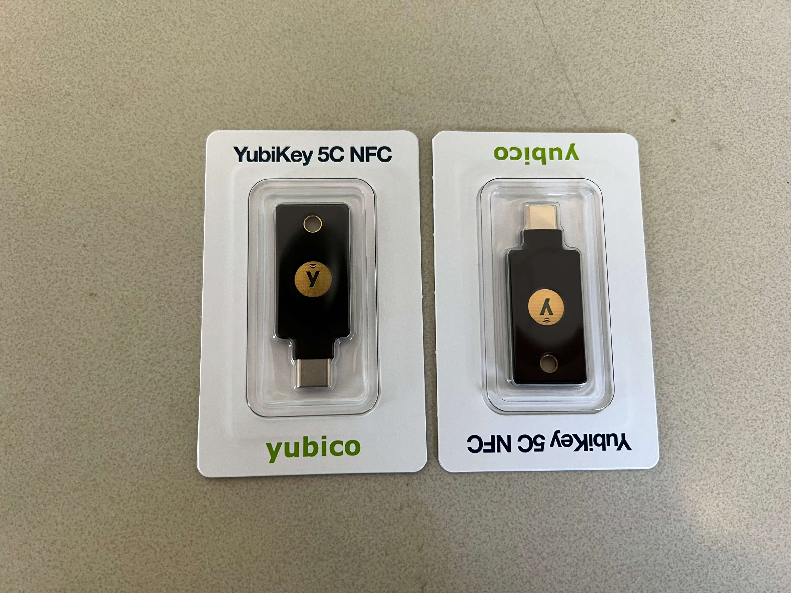

@zh@ 买了两把 [yubico](https://www.yubico.com/) 的安全钥匙，把所有常用且关键的账号都加密。

@en@ I got two security keys from [yubico](https://www.yubico.com/) and most of my important accounts with the keys. 

@zh@ yubico 面向大众使用的安全密钥有6种，我弄了两个C/NFC的；记得其他还有USB/NFC，C-lighting，mini型的C口和mini型的A口，还有就是一个单独正常C口的。由于CloudFlare有两个账号，当时CF的promotion没搞定怎么领取就错过了大减价，用了学生优惠大概90刀入了手。

@en@ yubico offers 6 kinds security keys for general customers. The ones I got support both Type-C ports and NFC. Others kinds of keys include USB-A/NFC, C-Lightning, mini Type-C, mini Type-A, and Type-C only. There was an promotion offered by CloudFlare a few months ago but I missed because my account has access to two accounts and I got disoriented by that. The student promotion offered by yubico allowed me to purchase these two keys for 90$. 

@zh@ 使用体验上讲的话，会比普通的 one-time password (OTP) 慢一些，毕竟要插入密钥然后触碰一下，不如密码管理器直接自动填充。因此有点想买 mini Type-C 的，这样应该能够一直插在电脑上也会更快一点。但是，没钱。为了方便还是只给几个关键且不常异地登陆的账号关联上了密钥。应该都挺安全的了，后面只能祈祷丢三落四的自己不会把密钥丢了...

@en@ In terms of user experience, the security keys are a bit slower than one-time password (OTP) because I have to insert the key and tap on it to confirm using it whereas I can fill in OTP with just one click with my password manager. The deliberateness makes me want to by the mini Type-C key since I can keep the key connected with my computer all the time. BUT, my wallet is quite flat now. For simplicity and convenience, I paired only the keys with my important accounts that don't get logged in unknown environment often. Everything should be pretty secure right now; all I can do is pray the careless me won't lose the physical key...

@zh@ oh，写这个其实是想说现在可以用标题下的语言来调整要显示那个语言啦！

@en@ Oh, the purpose of writing this post is to show that you can now click on the languages below the title to switch between available languages! 

@zh@ 下一个要做的是处理一下图像的压缩，可能写个Vite的插件看看，在 build 的时候转化退片

@en@ The next goal is to work on image compression. Maybe I should write a Vite plugin so that it can shrink images during compile time. 
