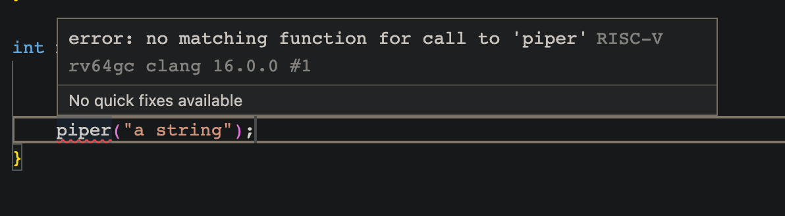

One friend was working on UE and wanted to create a pipeline for certain data types. For example, he would like a function that takes in a `std::string` and eventually wrap the string to `WrappedString`, or an input `int` to `WrappedInt`, etc. So the question basically is "is there a way to map types in C++". 

It's easy to do it in Python because types are treated as objects. To tackle this question, we can create a mapping from types to types, like the following example. And we can write handy macros if we are working with Rust. But macros in C++ seem to be a pain and types are not objects. 

```python
DATA_TYPE_MAPPING = {
    str: WrappedString, 
    int: WrappedInt,
    bool: WrappedBool
}

def piping(data):
    # do something here ...
    data_type = type(data)
    
    try:
        wrapper = DATA_TYPE_MAPPING[data_type]
    except KeyError as e:
        raise TypeError(f"No matched wrapper type for the type {data_type}") from e
    
    return wrapper(data)
```

We can of course write overloaded functions. But if the only changing things are the types and what they are mapped to, overloading seems to be too much due to duplications. For example, the following code seems quite verbose. 

(The highlighted lines will be implicitly included in all the code snippets below if not specified otherwise)

```cpp {1-9}
#include <iostream>

template <typename S>
struct Wrapper {
    S data;
};

using WrappedInt = struct Wrapper<int>;
using WrappedDouble = struct Wrapper<double>;

WrappedInt piper(int t) {
    // do something, e.g.: 
    t = t * t;
    return {t};
}

WrappedDouble piper(double t) {
    // do something, e.g.: 
    t = t * t;
    return {t};
}

int main() {
    std::cout << piper(1).data << std::endl; 
    std::cout << piper(1.0).data << std::endl;
}
```

We all know duplications are bad. How can we simplify that? Wait, C++ has great type checkers. Why don't we use that! 

Type checkers are wonderful things. It's strict and precise. Unlike runtime errors that could lurk around shoot you on your feet seemingly randomly, typing errors can be checked by the compiler even before the code is compiled. Yet it's also powerful. [This post](https://www.richard-towers.com/2023/03/11/typescripting-the-technical-interview.html) shows you how to do solve the classic eight queens problem with only types! (I think in Chinese people call this "类型体操" or typing artistic gymnastics, which is describing the slick sets of actions performed by players (or types in this case), hence the name of this post). 

Can we create type mappings with only types then? It turns out in this case is yes! 

First, let's create a `TypeMap` struct. It seems like many of the handy helpers in the [`<type_traits>`](https://en.cppreference.com/w/cpp/header/type_traits) header is defined with a struct. It looks like a plausible way to start. You can check out examples like [`true_type`](https://en.cppreference.com/w/cpp/types/integral_constant) and [`is_same`](https://en.cppreference.com/w/cpp/types/is_same). In the code below, given any type `T`, say `TypeMap<int>`, the `TypeMap<T>` will contain nothing. Ok? How do we do the mapping then? 

```cpp
template <typename T>
struct TypeMap {};
```

We can utilize the [partial template specification](https://en.cppreference.com/w/cpp/language/partial_specialization) to create specific mapping pairs. In the highlighted lines, `TypeMap` are not parametrized anymore. In the case of `TypeMap<int>`, the struct is defined to contain a type alias of `WrappedInt`, named [`type`](https://en.cppreference.com/w/cpp/language/type_alias). Similarly, in the case of `double`, we create a type alias also named type for `WrappedDouble`. Once those are written down, whenever we mention `TypeMap<int>` and `TypeMap<double>`, C++ will use the specific versions and allows use to access the `type` by using the scope resolution operator `::`. For example, `TypeMap<int>::type` will be evaluated to `WrappedInt`. 

```cpp {4-7,9-12}
template <typename T>
struct TypeMap {};

template <>
struct TypeMap<int> {
    using type = WrappedInt;
};

template <>
struct TypeMap<double> {
    using type = WrappedDouble;
};
```

With specific mappings defined, we can try to write a parametrized function that takes in an input of type `T` and returns `WrappedT`, where `T` can only be `int` and `double` in our example. Let's call the function `piper` that does some processing and returns our input wrapped a specific wrapper type. You can see that the return type of `piper` is now `typename TypeMap<S>`, which is the mapping result from the type `S`. (`typename` is used because we are accessing a [dependent type name](https://en.cppreference.com/w/cpp/language/dependent_name)) 

```cpp {14-18}
template <typename T>
struct TypeMap {};

template <>
struct TypeMap<int> {
    using type = WrapperInt;
};

template <>
struct TypeMap<double> {
    using type = WrapperDouble;
};

template <typename S>
typename TypeMap<S>::type piper(S t) {
    t = t * t;
    return {t};
}

int main() {
    std::cout << piper(1).data << std::endl; 
    std::cout << piper(1.0).data << std::endl;
}
```

How exciting! We have a type mapping! C++ thinks it's valid and it looks like it does the things we want it to do!

But, you may say, what if I write `piper("a string")` or pass in arguments that are not specified in the `TypeMap`? What would the type checker think? 



Ta-dah! Compiler knows it's wrong! We have safe code and no copying-pasting is required anymore! 

The links to the compiled version of the function-overloading and the template C++ code are [here](https://godbolt.org/z/K6TP1z8Tc) and [here](https://godbolt.org/z/34bExeWae), respectively. You can see that no overhead is added, for we only uses types that are stripped away in compiling time.   

Can you solve eight queens with only types in C++ then? Maybe I'll update on that one. But for now, I hope you enjoy this and have a good day (imitating James Hoffmann and his smile). :)
