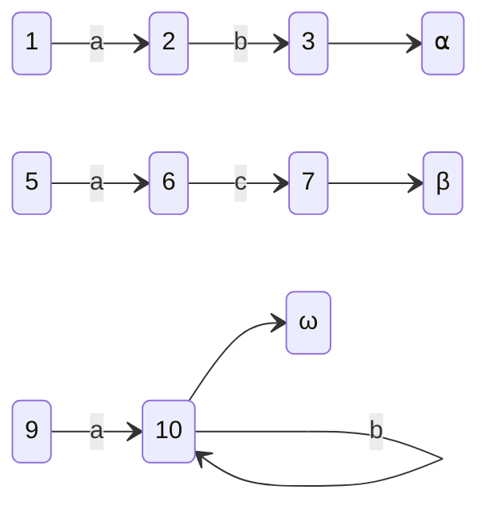
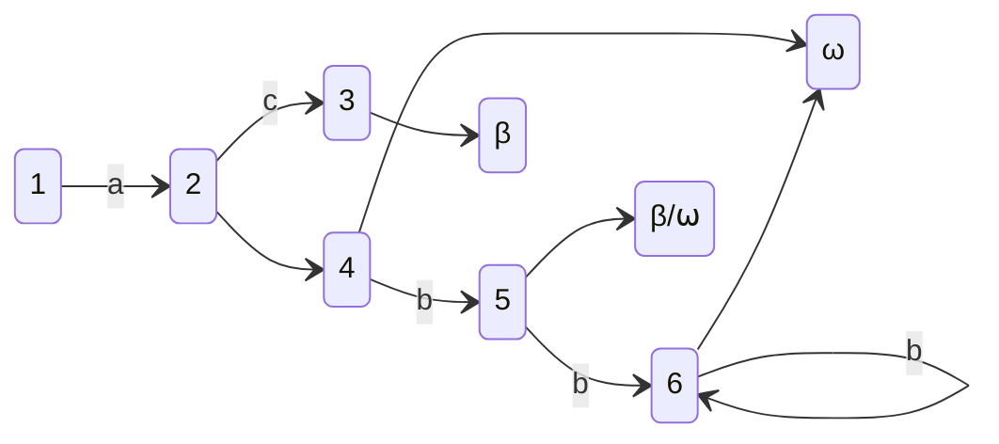
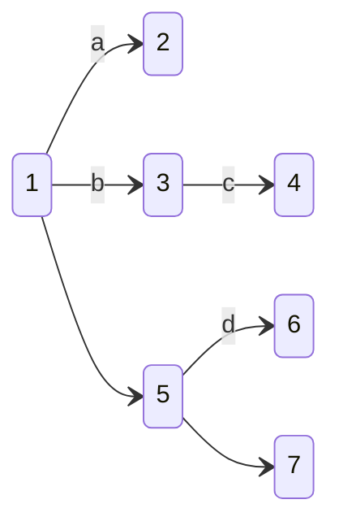
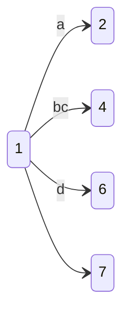

[[TOC]]

## What Is Kaleidoscope

I made a [tokenizer in swift](https://github.com/FlickerSoul/Kaleidoscope),
named Kaleidoscope with [Swift Macro](https://www.avanderlee.com/swift/macros/).
It’s inspired by [logos](https://github.com/maciejhirsz/logos), a rust tokenizer
library, but performs a bit worse 🤣

It allows you to create a tokenizer on a enum of tokens with just a couple
annotations. For example, the following code

```swift
import Kaleidoscope

let lambda: (inout LexerMachine<Tokens>) -> Substring = { $0.slice }

@kaleidoscope(skip: " |\t|\n")
enum Tokens {
    @token("not")
    case Not

    @regex("very")
    case Very

    @token("tokenizer")
    case Tokenizer

    // you could feed a closure directly to `onMatch` but swift doesn't like it for some reason
    // seems to be a compiler bug (https://github.com/apple/swift/issues/70322)
    @regex("[a-zA-Z_][a-zA-Z1-9$_]*?", onMatch: lambda) 
    case Identifier(Substring)
}


for token in Tokens.lexer(source: "not a very fast tokenizer").map({ try! $0.get() }) {
    print(token)
}
```

will generate the following output

```text
Not
Identifier("a")
Very
Identifier("fast")
Tokenizer
```

## How It Works

Internally, it maintains a finite automata, a direct graph where nodes are
states and edges are symbols to be consumed in order to move to the next state.

Each of the regex or exact strings for matching a token is converted into a
initial graph. We used the `_RegexParser` library in the experimental string
processing library to obtain the structures of regexes, and convert the
structures into one of the three basic patterns: walk, cycle, and terminals. For
example, to match, `ab` as `⍺`, `ac` as `β`, and `ab*?` as `ω`, we obtain the
following graphs. Note that the numbers on the node does not have any meaning
besides differentiating the nodes. However, the nodes labeled with greek
alphabets are the terminals, standing for a match if reached.



Then all initial graphs went through a merging process to obtain a single finite
automata.



Sometimes it's possible for multiple tokens to terminate in the same exit node.
Since we want a deterministic lex outcome, only one token can be specified per
exit node. This is sorted out by an ordering system: the more specific the token
is specified, the higher the rank is. The library then chooses the token with
the highest rank when there are multiple choices. When two tokens have the same
highest ranks, the programmer needs to specify a priority to help the library
choose a token. For example, in the diagram above, state 5, by matching nothing,
can go to a terminal that stands for a matching for either `β` or `ω`. Suppose,
the rank of `ω` is higher than that of `β`, then the terminal will be resolved
as `ω`.

Kaleidoscope tries to be smart so that moving from one state to another consumes
as many character as possible, instead of a single character each time. It also
tries to flatten the graph as much as possible to reduce the size and the number
of jumps.

In the example below, you can see the lexer needs to consume `b` and
the consume `c` to reach state 4 from 1 through state 3. Note that, because
there are no other branches in state 3, we can compress the path into one.
Similarly, we can compress the step from step 1 to step 5, knowing from state 1
to state 6 is equivalent to consuming only `d` and from state 1 to state 7 is
equivalent to consuming nothing.

All these efforts save time for matching a token!





## Why

The reason why I called it kaleidoscope is because I was following the official
guide for LLVM. The guide teaches how to implement an interpreter and a compiler
for a made up language named Kaleidoscope, in which the first step is to
implement a tokenizer…

Great! The kaleidoscope lang is syntactically similar to Python and I have a
tokenizer built from yacc in cpp.

But I don’t want to write cpp. I want to do rust!

Then I found the legos library. Awesome! I can make my own simple lexer from
scratch in couple of days, right…?

What? The `proc_macro` thing wants to be the only thing on the top of the
package?? Rust’s macro is too complicated…

Oh swift just introduced macro right? It’s a good time to learn it! It shouldn’t
take long, …right?

Two days in, what’s a parser for regex ast in swift?

Five days in, I didn’t expect merging automata paths this hard…

Seven days in, oh I forgot about regex negation parsing

Today, after two weeks, finally a slowly working tokenizer! I guess I should
resume the LLVM tutorial then 🤣
