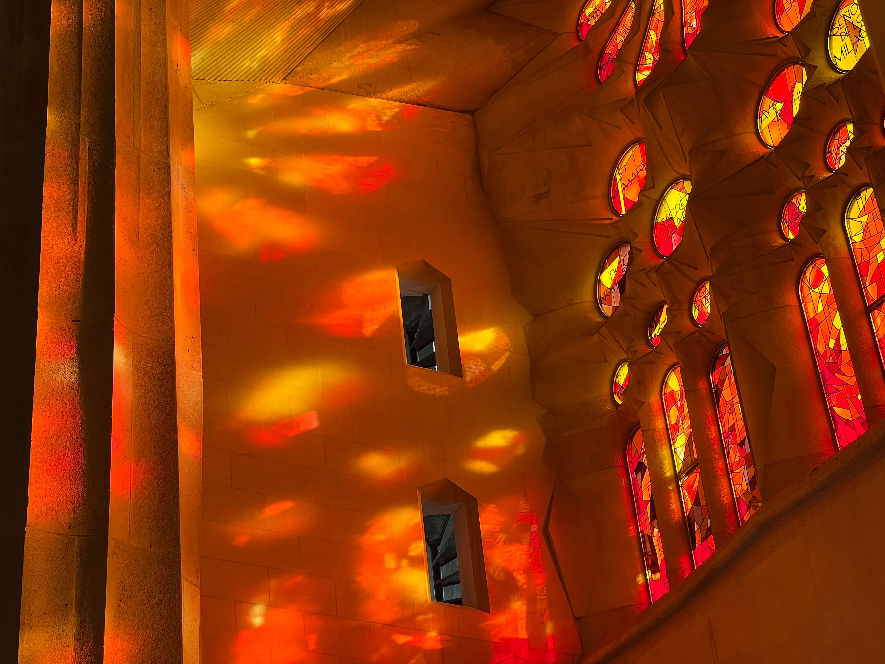
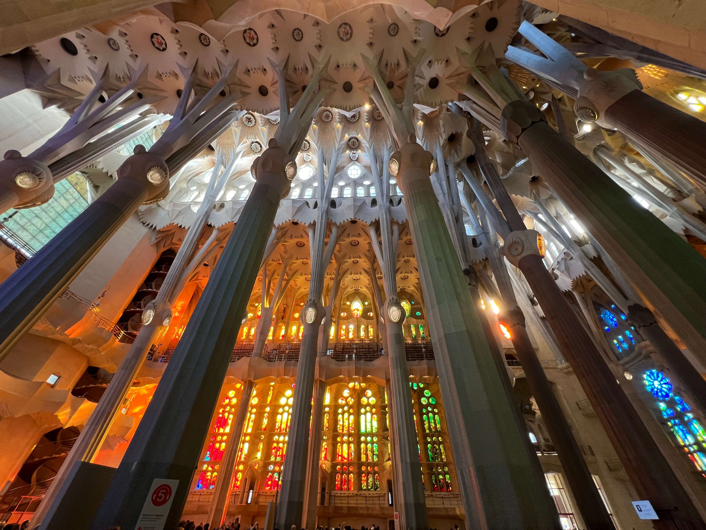
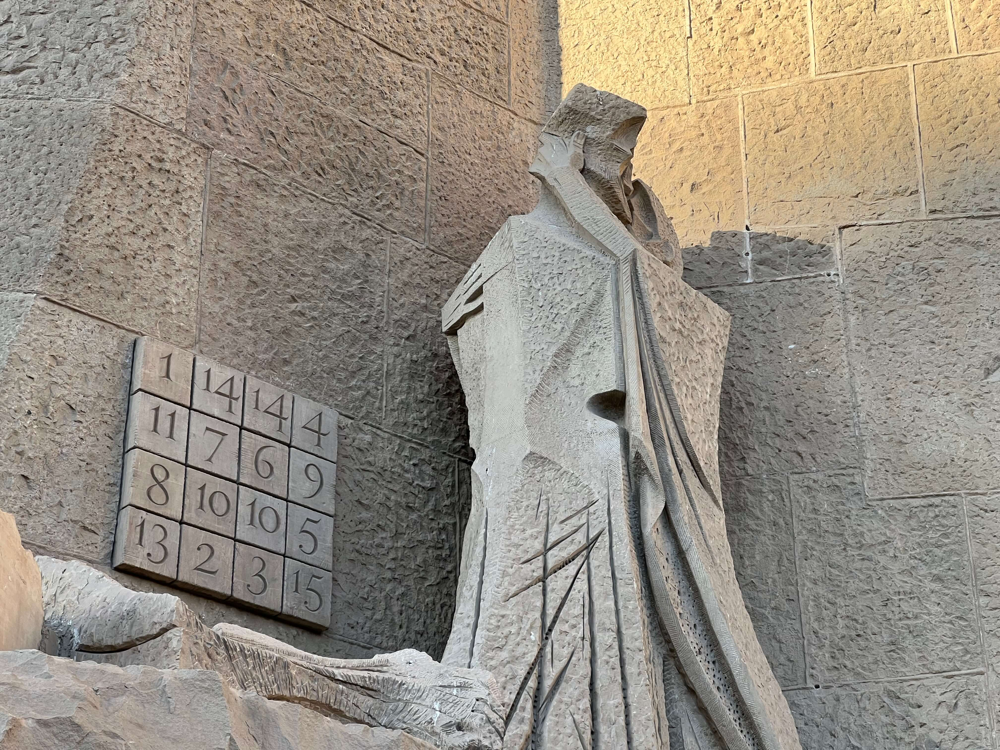

I stayed at Barcelona for couple of days and visited Sagrada Familia at the
time. It was a memorable place, sacred, peaceful, and inspiring. The atmosphere
created by light and shadows and the the tree like ceiling structure are meant
to be remembered forever. The photos cannot convey even 1 percent of the beauty
and I recommend everyone visit the place.

It was interesting and kinda of surprising that there
exists [a square at the entrance of
Passion facade](https://blog.sagradafamilia.org/en/divulgation/the-magic-square-the-passion-facade-keys-to-understanding-it/)

You can notice the sum of the rows, columns, and diagonals sum to `33`,
representing the age of Jesus when he died for us all. Christianity does not
click with me, so I thought it would be cool if I can make a square that carries
an important number for everyone.

I did some research, and it looks
like [some specific magic squares can be solved
with a pretty easy algorithm](https://mathcommunities.org/magic-squares/). Below
is just a sketch of a depth first search. You can try with small numbers,
because big numbers can blow up the browser and crash the tab 🤣. The current
result squares have their rows, columns, and two diagonals added up to the same
magic number.

I may try to find something to speed up the computation. Till then,

<GridDisplay />
