[[TOC]]

## Introduction

The code is finally
live [here](https://github.com/Soundscape-Project-UCL/Soundscape)! You can hear
part of the audio experience in [this section](#beacon-expr-demo) of the post.

The idea of using Spatial Audio to navigate isn't new. Soundscape was originally
incubated and
developed [on iOS by Microsoft Research](https://github.com/microsoft/soundscape).
The app serves spatial audio to indicate the user's destination and surroundings
as if the sound comes from th ose places, by leveraging the global position and
orientation obtained from AirPods' the head tracking sensors and other sensors
from user's phones (such as GPS and magnetometer). The app, designed with
visually impaired people in mind, provides a hands-free navigation experience,
allowing users to navigate the world and get familiar with their surroundings.

However, the app is only available on iOS, which has only a relatively small
market share, compared to its competitor, Android. Therefore, the cofonder of
the project requested 8 of us in UCL Software Systems Engineering to port a
minimal viable product of Soundscape to Android.

The project first went though the planning phase, where were discussed the
requirements, the architecture, and the timeline. The app has several core
features:

- **Navigation with audio beacon**: the app indicates the user's destination
  using a continuous audio cue that changes it's quality based on the user's
  orientation: the better the orientation is aligned with the destination, the
  more positive the sound cue is. We call this continuous sound cue as audio
  beacon.
- **Callouts of surroundings**: the app calls out the user's surroundings when
  they request so or when they move around. The callouts are also spatialized as
  if the callout sound originates from the place it describes. For example, when
  you walk along the street, you will hear "cafe 10 meters" from your right (
  because there is a cafe cross the street 10 meters away), and "bus stop, 20
  meters" from your front left (because you will see a bus stop if you turn left
  around in the upcoming crossing).
- **Markers and Routes**: the app allows the user to save markers (a location
  they are interested in, such as a particular bus stop or grocery store) and
  routes (a sequence of markers that the user want to follow). This allows the
  user to navigate themselves to where they want to be easily.

We have also implemented many other essential functionalities such as settings
that controls many aspects of audio, the integration with Google maps, and
accessibility integrations with TalkBack and VoiceOver.

The architecture of Soundscape is designed to be event driven. This is because
the audios are played based on the user's location, orientation, and movement,
which are all events that flow from sensors or user interactions.

We divided 8 of us into 4 groups, each responsible for a different component of
the app:

- UI team: all the UI components and data persistence
- Map team: integrations with Google Maps and OpenStreetMap, along with
  utilities for computations and data pipeline of objects on the maps
- Sensor team: sensor data retrieval as services and sensor data processing
- Audio team: audio engine that uses Text-to-Speech to synthesis callouts from
  text, spatializes, mixes, and plays audio cues and callouts, and provides a
  event loop for callouts responding to user movements.
- Both sensor team ang audio team work on a event bus that's used to carry data
  and share among modules.

Because of the time constraint, there are still many great features that weren't
listed in our planning. However, we hope the future team can take over our work
and continue making Soundscape a complete and optimal navigation solution for
people who need it.

## Technologies and The Audio Stuff

### Technologies

We decided to use Kotlin (with JNI) for developmemt, Jetpack Compose for UI,
Room for persistence, and, latter in the course, hilt (dagger) for dependency
injection and proto DataStore for lightweight data persistence duch as values in
settings. We also used GitHub Actions as the CI/CD provider for testing,
building, and delivering the artifacts to our client.

I had no previous experience with Android nor Kotlin. However, my past
development on iOS allowed me to understand the design and pick up Android
specific things pretty quickly.

### The Audio Team

I worked in the audio team, along with Raimund, because I think the audio part,
being one of the key components in the app,
is the most challenging and interesting component of the app. It turned put to
be true, because unlike iOS which provides many AMAZING high-level and yet
POWERFUL audio APIs and access to AirPods' head tracking sensors, Android has
very limited APIs that allow the level of customizability and control we need.

The process of building the audio part has mainly three stages: making a audio
renderer from a existing low-level audio engine, implementing state-aware
players that can play, pause, and queue audios to be spatialized and rendered (
played) by the audio renderer, and creating and providing a audio service
containing the functionalities to other parts of the app, along with an UI
interaction commander that triggers callouts according to users' need.

### ACT I: The Audio Renderer

The first step was to find a suitable audio engine for audio spatialization and
customization. It was clear to us that it is impossible to implement an engine
from scratch and that there didn't seem to exit anything high level in the
kotlin world. We decided to use JNI and focus on engines implemented in C or
C++. There are many choices on the market: Steam Audio, Oboe, OpenAL, FMOD,
SoLoud, etc. We chose SoLoud because it is open source, powerful, and
lightweight. The only down side is that SoLoud, even though it works, is not
actively maintained: the existing audio backend support for Android (OpenSL ES)
is already deprecated, and the new backend (AAidio) is out of horizon.

Thee process of choosing an engine wasn't easy. I personally did not have any
prior experience regarding audio processing, not to mention audio spatialization
and mixing. I and Raimund spent quite some time figuring out what exactly we
need and what each engine can offer. Raimund's great information gathering
ability led us to Steam Audio and SoLoud. We played and struggled with steam
audio first, and found it offers spatialization (and mixing if I remember
correctly), but it does not offer playing capability, one of the things we also
desperately needed. SoLoud, on the other hand, offers everything we needed and
stroke us with its simplicity and ease of use. After around a week of
researching, we decided to go with SoLoud.

Once we've decided SoLoud is our choice, we started to creating APIs for kotlin
world using JNI. This was basically done by an wrapper over SoLoud along with
necessary data structures, such as bytes of audio source, and specific JNI
bridge functions that creates and interacting with pointers to the wrapper
instances. Together, we allowed kotlin to prepare audio sources for playing,
play, pause, stop, and spatializes audio the sources, and thus we have a audio
renderer, completing the first stage.


One of the tricky things we encountered was changing the audio cues based the
quality of user orientation. As mentioned, the closer the user is facing the
destination, the more positive the sound cue is. Internally, we have 2 to 4
tracks per sound cue; every track has the same length and each track has a
different positiveness. To allow transition from one track to another, we first
decided to natively play all tracks at the same time but only allow the one
appropriate track to have an audible volume while others' volumes are set to 0;
as the user changes their orientation, different tracks will have their volumes
changed accordingly. However, because SoLoud does not provide a way to do this
batch action: turn up the volume of one track and turn down that of the other,
one has to do this one by one, which incurs delays in between the changes and
breaking the continuity of what the user would hear. We then wrote our own batch
action and achieved a better effect, although it is still not perfect. We are
eventually moved to a beat system, mimicking what's been done on the iOS
side. Essentially, each sound cue had number of beats and these beats are marks
of spots on which changing tracks wont be noticeable. This also means all of the
tracks of the cue have the same number of beats, meaning even though the
currently playing track can be changed at any time, we only change what's been
played on the beat, creating a seamless transition.
To do so efficiently, we are creating a audio data source that's aware of the
bytes of all tracks and the number of beats; the audio data source serves
the bytes of the track that's currently playing and starts to serve the bytes
of the next track when the end of a beat is reached.

We also swapped out the deprecated OpenSL ES audio backend to the modern AAudio
to ensure the longevity of this product.

I attached several audio samples below for you to get an understanding of what
you would experience. <span id="beacon-expr-demo" />
_**Make sure you wear your headphones for the best experience!**_

> [!Note]
> This is a on-axis audio, a positive sound representing facing the right
> direction:
>
> <audio controls loop>
> <source src="https://github.com/soundscape-community/soundscape/raw/main/apps/ios/GuideDogs/Assets/Sounds/Beacons/Classic/Classic_OnAxis.wav" type="audio/wav">
> </audio>
>
> And this is an off-axis audio, a less positive sound representing facing a
> less
> accurate direction:
>
> <audio controls loop>
> <source src="https://github.com/soundscape-community/soundscape/raw/main/apps/ios/GuideDogs/Assets/Sounds/Beacons/Classic/Classic_OffAxis.wav" type="audio/wav"/>
> </audio>
>
> And together, when facing in different directions, you can experience the
> transitions between on-axis and off-axis sounds.
>
> The following is a sample recorded from
> the iOS version.
>
> <audio controls loop>
> <source src="./transition-sound-ios.mp3" type="audio/mp3" />
> </audio>
>
> And this is a sample recorded from our Android version
>
> <audio controls loop>
> <source src="./transition-sound-android.mp3" type="audio/mp3" />
> </audio>
>
> <details>
> <summary>previous attempt</summary>
>
> The following was a recording from our previous attempt. We did not do
> anything more than just facing different directions, same as what's been down
> in
> previous recordings.
>
> <audio controls loop>
> <source src="./transition-sound-bad-android.mp3" type="audio/mp3" />
> </audio>
> </details>

### ACT II: The Players

Once we had the renderer, we needed to invent players to play, pause, and queue
audio sources to be rendered by the renderer. In our design, there are two kinds
of players in the app: the one that plays audio beacon _**continuously**_ (
meaning it's always playing unless it's paused or stopped) and the one that
plays callouts _**discretely**_ (meaning it plays one thing at a time in the
queue, and stops if there are nothing to play). The two kinds of players share
many comment processes and states, thus finding the balance and creating a
common abstract class that can be reused in both players are crucial and
intricate. I am pretty happy and proud of the abstraction I've created.

The hardest part turned out to be dealing with threading (or coroutines) and
race conditions. This is due to the nature of an application which uses the main
thread for UI and other background threads for various tasks. Audio playing is
counted as one of the background tasks and deserves its own thread. We decided
to do it in kotlin´s way: coroutines. Because the players are stateful, we need
to manage the life of spawned coroutine jobs for playing and sensor updates. In
addition, since the playing job mainly uses JNI code which doesn't provide
suspension points like some of the native coroutine utilities, we had to
manually do the hassle of checking if the job is canceled. Luckily, we have
testing to help us ensure the players are working as expected and the
development of players was mostly smooth.

```mermaid
graph
    subgraph CP ["Player (for audio beacon and callouts)"]
        direction TB
        PLAYING -->|pausing the audio| PAUSED
        PLAYING -->|finishing the current playing and exhausting the play queue| STOPPED
        PLAYING -->|stopping the audio| STOPPED
        PAUSED -->|resuming the audio| PLAYING
        PAUSED -->|stopping the audio| STOPPED
        STOPPED -->|preparing the audio source| PAUSED

        subgraph STOPPED
            direction LR
            s1["🚫 Location update"]
            s2["🚫 Orientation update"]
            s3["🚫 Playing coroutine job"]
            s4["🚫 Audio resources"]
        end

        subgraph PLAYING
            direction LR
            pl1["✅ Location update"]
            pl2["✅ Orientation update"]
            pl3["✅ Playing coroutine job"]
            pl4["✅ Audio resources"]
        end

        subgraph PAUSED
            direction LR
            pu1["🚫 Location update"]
            pu2["🚫 Orientation update"]
            pu3["🚫 Playing coroutine job"]
            pu4["✅ Audio resources"]
        end
    end
```



### ACT III: The Audio Service, Commander, and the Callout Looper

Once players are ready to manage and serve audio, we need a service that ensures
the liveness of players even when the app is in the background. We designed the
service to contain all the audio components including a continuous player, a
discrete player, a text-to-speech engine, and a callout looper. Additionally, we
implemented a commander that processes users' interactions and triggers
corresponding callouts. Conveniently, we allow the service to be paused and
resumed when user requests so; when paused, the service pauses all players and
their updates from sensors, saving battery and CPU usage. The service also
serves as an entry point and a bridge so that the audio components are
initialized properly through the service and other parts of the app can use them
easily.

Since the service is essentially a collection of independent component part
instances, we use kotlin's "mixin" to simplify and make the code more readable.
A mixin can be create
through [delegation](https://kotlinlang.org/docs/delegation.html). Thus, each
component part resides in its own mixin class, and the service class is a
composition of these mixin classes. This allows us to easily add or remove
components, code a particular component without distractions, and test each
component separately.

We also used data injection architecture to inject necessary components using
hilt. This made our life easier because we don't need to create and manage the
dependencies manually. Instead, the dependencies are mostly provided from a
central place, allowing us to add, remove, or change dependencies easily. A
rough structure is shown as below.


The callout looper is the last thing added to the audio service. As we
discussed, the looper calls out user's surroundings based on user's movements.


### Some Miscellaneous Stuff

Surprise, surprise! I also did quite a lot other stuff than being in the the
audio team.

#### CI/CD

I'm a big fan of automation so I did the CI/CD pipelines: one for building the
project and uploading the signed artifact to an Google Drive for sharing with
our client, the other one for instrumented testing and unit testing during
pushing and PRs.

#### Documentation

Since I'm in charge of the CI/CD pipeline, which covers most of the building and
testing process, I wrote the documentations to explain all the processes to make
future contributions smooth.

#### Some UI and Optimization

Part of integration of the audio stuff required me to write some UI, such as
selectors for different types of beacon tones. We used Jetpack Compose,
declarative type of UI composition similar to SwiftUI and Vue, which is quite
convenient and my past experience in web developement and Swift UI development
helped a lot. Dependency injection and MVVM model was used extensively in those
UIs and allowed to me manage the UI and sync the UI with settings and audio part
easily.

During my UI integration, I found several places where
Kotlin [flows](https://kotlinlang.org/api/kotlinx.coroutines/kotlinx-coroutines-core/kotlinx.coroutines.flow/-flow/)
are abused. Because it was the first many using Kotlin for many of us in the
team, learning all bits of the language wasn't easy. My implementation of the
event bus helped me gain extra understanding
towards [Kotlin coroutines](https://kotlinlang.org/docs/coroutines-overview.html)
and thus the usages of flows.

A common mistake made was piping and transforming data from one flow to another.
Suppose there are two flows (or pipelines), one for bags of flour and the other
one for buckets of waters, and we want to create a flow of dough out of the
flour and water from the flow. It is tempting to create an empty flow and an "
actor" who picks out one bag of flour and and one bucket of water, put it
through some processing, and then drop the processed dough to the new empty
flow (shown in the highlight).

```kotlin {12-21}
fun doughProcessing(flour: String, water: String): String {
    return "dough = $flour + $water"
}

class SomeViewModel : ViewModel() {
    // usually provided by some other dependencies
    val flourFlow = (0 until 5).map { "flour" }.asFlow()
    val waterFlow = (0 until 5).map { "water" }.asFlow()

    val doughFlow = MutableStateFlow<String?>(null)

    init {
        viewModelScope.launch {
            flourFlow.collect { flour ->
                waterFlow.collect { water ->
                    val dough = doughProcessing(flour, water)
                    doughFlow.value = dough
                }
            }
        }
    }
}
```

This way of working with flow is both verbose and not efficient (and incorrect
sometimes). It makes more sense to transform and pipe data using flow operators,
just like functional programming:

```kotlin {10-14}
fun doughProcessing(flour: String, water: String): String {
    return "dough = $flour + $water"
}

class SomeViewModel : ViewModel() {
    // usually provided by some other dependencies
    val flourFlow = (0 until 5).map { "flour" }.asFlow()
    val waterFlow = (0 until 5).map { "water" }.asFlow()

    val doughFlow = flourFlow
        .combine(waterFlow) { flour, water ->
            doughProcessing(flour, water)
        }
        .stateIn(viewModelScope, SharingStarted.Eagerly, null)
}
```

## Some Lessons

This project was my first time working with a large group of people in a large
codebase. The experience has been unique and very different from working on
projects myself or with few close friends.

The main difference comes from communication. As the number of people increases,
the effort for communication increases factorially (which is essentially
exponential). We had four teams working on four features in parallel and it
becomes hard to communicate what one's wish for the application to become. I'm a
good engineer and my working habits lures me to completes the work until
perfection, even though the responsibility may belong to other people. I force
myself communicate my idea and try to convince other people it is a good idea,
instead of jumping on the problem and solve it directly. This kinda of
communication often happens during code reviews, making it particular hard
because I don't want my wording to be discouraging while still provide
suggestions and ideas, and I don't want to sound underestimating their good
work.

I also experience the challenge of managing a large codebase in which parallel
works happen relative frequent. We sort of followed agile methodology and met
with our client once a week to report our progress and adjust our goals. As a
result, people tended to work in the first half of a sprint and merge their
contributions near the end of the sprint. It was fine most of the time because
the teams worked in different components that didn't have much clash most of the
time. But when it did, merging was difficult. There were three things I
remembered the most.

- **Automated tools like linting, testing, and building**: we didn't start with
  a automatic style checking setup such
  as pre-commit. I, in charge of most of the DevOps, investigated a bit and
  didn't find a suitable linter for Android projects. As a result, when people
  forget to turn on formatting on save or optimizing imports on save, reviewing
  and merging turns into hell, since you don't know what are the actual changes
  and what should be accepted or safely deleted.

  I was lucky that I could setup functioning testing and building CICD for the
  project. Passing the checks has been like lullaby, comforting and reassuring.
  The CICD also allows us to share the artifacts with our client easily, since
  our repository was set to private to avoid conflicts and piracy on our work.

- **Structural changes**: they are expensive and can be devastating to the
  teams' goal and speed. In the middle of the project, we decided to add hilt to
  enable dependency injection and support our development. The transition to
  hilt took Raimund almost two weeks, if I remember correctly. The change was
  huge and we were all scared of introducing breaking changes that can be hard
  to fix and hog our development. Moreover, I remember I had some time off
  because I needed to wait for the dependency inject to be merge before some of
  the audio stuff can be started. In the end, the structural change did
  introduce some breaking change that took us non-trivial amount work to fix,
  which was luckily not on the expensive side and did bring ease to later
  developments.

- **Best practices and inner peace**: there are so many best practices I learnt,
  ranging from management to git to kotlin and Android specifics. However, not
  everyone follows them and some of the code did make me a bit mad. For example,
  we have database that doesn't have a migration setup, meaning we could run
  into trouble when we change our schema. I'm always
  pursuing for perfection and this aspect I can't control made me a bit nervous
  and drove me a bit crazy (just a bit, I promise). I ended up improving some of
  the content and set peace with myself to accept the imperfect parts in the
  project.

For now, theses are the thoughts that are on top of my mind. I'll keep update
with anything I can think of.
